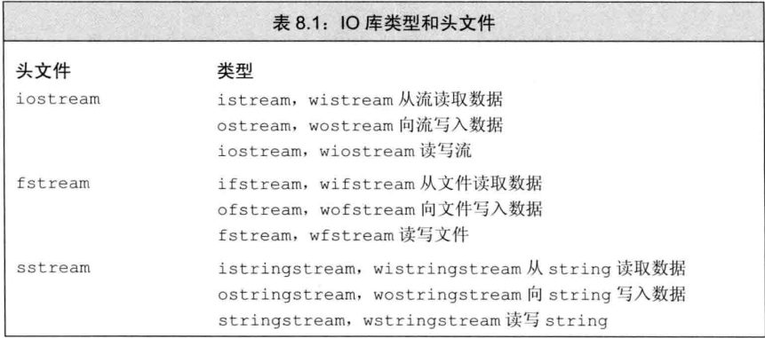
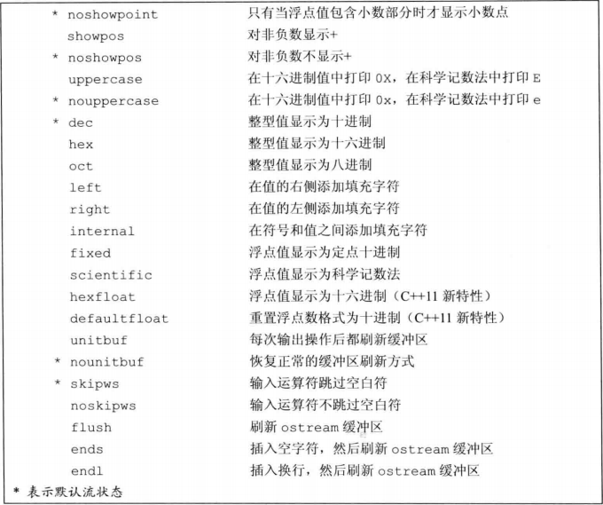
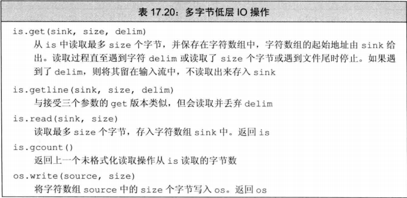
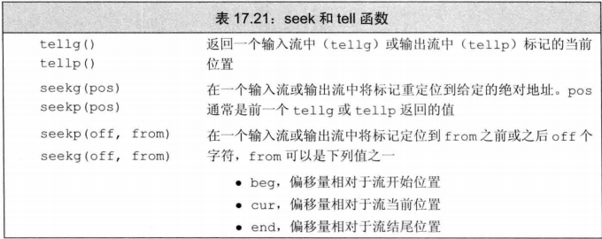

# 第十五章 标准库

## 15.1 标准库概念

C++标准库（standard library）是C++委员会所提供的由C++语言所编写的一系列头文件。
这些库扩展了很多C++的操作，比如C++语言并未定义任何输入输出操作，所以输入输出操作是由标准库来提供的，C++标准库还提供了其他许多的功能。

因为标准库是官方所提供的头文件，不是语言自带的语言特性，所以我们在使用标准库时必须要用`#include`预处理指令来包含所需要使用的标准库头文件。

> 对于标准库头文件来说，`#include`预处理指令后的文件名是用符号`<>`而不是`""`来包含。

```c++
// c++输入输出标准库文件
#include <iostream>
```

因为C++是从C语言的基础上拓展而来的，所以C++语言也兼容了C语言的标准库。
我们可以直接使用C语言标准库，也可以使用有C++修改后的C语言标准库，这些经过C++修改后的C语言标准库和原始标准库的内容是一样的，只不过从命名规范上来讲更符合C++语言的要求。
修改后的C语言标准库与原始的C语言标准库有以下区别：
* 修改后的C语言标准库的所有头文件名都在其最前面加上了字母`c`，而且末尾也不用再加`.h`。
* 修改后的C语言标准库中定义的名字从属于命名空间std，而原始标准库中的则不然。

```c++
// C语言输入输出标准库文件
#include <stdio.h>
// 经过C++修改后的C语言输入输出标准库文件
#include <cstdio>
```

对于C++标准库来说，我们所常用的操作分为以下几个部分：
* 输入输出操作(io操作)
* 容器
  * 顺序容器
  * 关联容器
* 迭代器
* 泛型算法
* 多类型集合
  * tuple类型
* 位集合
  * bitset类型
* 正则表达式
* 随机数
* 内存管理

## 15.2 输入输出操作

### 15.21 输入输出概念



#### 15.211 条件状态


#### 15.212 操纵符




##### 15.2121 输出补白


#### 15.213 未格式化IO

##### 15.2131 单字节操作


##### 15.2132 多字节操作




#### 15.214 流随机访问



### 15.22 fstream


### 15.23 stringstream


