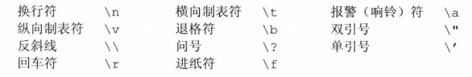
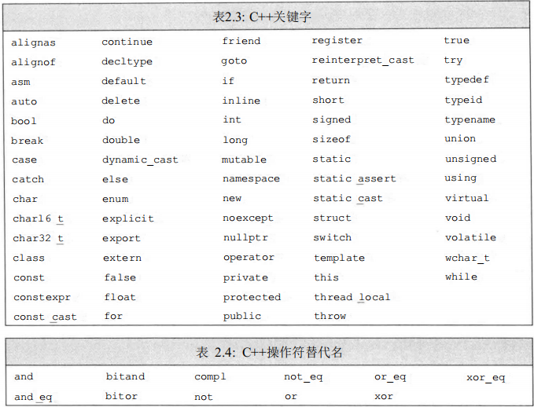

[TOC]
## 第二章 基本类型与变量

### 2.1 基本数据类型

cpp的数据类型衍生与c的数据类型，以下为cpp的数据类型分类
* 空类型(void)
* 算术类型
  * 基本类型
    * 整数类型
      * 短整型(short)
      * 整型(int)
      * 长整型(long)
      * 双长整型(long long)
      * 字符型(char)
        * 宽字符(wchar_t)
        * Unicode字符(char16_t/char32_t)
      * 布尔型(bool)
    * 浮点型
      * 单精度浮点型(float)
      * 双精度浮点型(double)
      * 扩展精度浮点型(long double)
* 复合类型
  * 数组类型([])
  * 引用类型
    * 左值引用(&)
    * 右值引用(&&)
  * 指针类型(*)
    * 普通指针
    * 与数组有关的指针
    * 函数指针
    * 类成员指针
* 派生类类型
  * 函数类型
  * 自定义类型(类类型)(struct/class)
  * 枚举类型(enum)
  * 共用体类型(union)

#### 2.12 算术类型

基本内置类型是由系统定义的，最基本的几种类型，我们常用的比如字符，整型都是基本类型，以下是基本数据类型的分类

* 算术类型
    * 整数类型
      * 短整型(short)
      * 整型(int)
      * 长整型(long)
      * 双长整型(long long)
      * 字符型(char)
        * 宽字符(wchar_t)
        * Unicode字符(char16_t/char32_t)
      * 布尔型(bool)
    * 浮点型
      * 单精度浮点型(float)
      * 双精度浮点型(double)
      * 扩展精度浮点型(long double)

类型的尺寸也就是该类型数据所占的比特数，在不同机器上有所差别，类型数据所占的比特数的不同，可以决定了该类型能够表示的数据范围。

以下是各个类型所规定的的尺寸


布尔类型（bool）的取值是真（true）或者假（false）。

C++提供了几种字符类型，其中多数支持国际化。基本的字符类型是char, 一个char 的空间应确保可以存放机器基本字符集中任意字符对应的数字值。也就是说，一个char 的大小和一个机器字节一样。

其他字符类型用于扩展字符集，如wchar_t, charl6_t, char32_t。

wchar_t类型用于确保可以存放机器最大扩展字符集的任意一个予符，类型char16_tln char32_t则为Unicode字符集服务（Unicode是用于表示所有自然语言中字符的标准）。

除字符和布尔类型之外，其他整型用于表示（可能）不同尺寸的整数。C++语言规定一个int至少和一个short一样大,一个long至少和一个int一样大，一个long long至少和一个long一样大。其中，数据类型long long是在C++11中新定义的。

浮点型可表示单精度、双精度和扩展精度值。C++标准指定了一个浮点数有效位数的最小值，然而大多数编译器都实现了更高的精度。通常，float以1个字（32比特）来表示，double以2个字（64比特）来表示，long double以3或4个字（96或128比特）来表示。一般来说，类型float和double分别有7和16个有效位；类型long double则常常被用于有特殊浮点需求的硬件，它的具体实现不同，精度也各不相同。

计算机以比特序列存储数据，每个比特非0即1,例如：
```00011011011100010110010000111011...```
大多数计算机以2的整数次寡个比特作为块来处理内存，可寻址的最小内存块称为“字节（byte）”，存储的基本单元称为“字（word）”，它通常由几个字节组成。在C++语言 中，一个字节要至少能容纳机器基本字符集中的字符。大多数机器的字节由8比特构成， 字则由32或64比特构成，也就是4或8字节。
大多数计算机将内存中的每个字节与一个数字（被称为“地址（address ）”）关联起 来，在一个字节为8比特、字为32比特的机器上，我们可能看到一个字的内存区域如下所示：


其中，左侧是字节的地址，右侧是字节中8比特的具体内容。
我们能够使用某个地址来表示从这个地址开始的大小不同的比特串，例如，我们可能会说地址736424的那个字或者地址736427的那个字节。为了赋予内存中某个地址明确的含义，必须首先知道存储在该地址的数据的类型。类型决定了数据所占的比特数以及该如何解释这些比特的内容。
如果位置736424处的对象类型是float,并且该机器中float以32比特存储， 那么我们就能知道这个对象的内容占满了整个字.这个float数的实际值依赖于该机 器是如何存储浮点数的。或者如果位置736424处的对象类型是unsigned char,并且 该机器使用ISO-Latin-l字符集，则该位置处的字节表示一个分号。

##### 2.121 无符号类型

除去布尔型和扩展的字符型外，其他的整型可以划分为两种
* 带符号的(signed)
* 无符号的(unsigned)

带符号的可以表示正，负和0的数，cpp规定了在表示范围内正值和负值的量应该保持平衡。比如8bit的signed char通常表示范围为-128至127。

而无符号的不能表示负数，但无符号中能表示的数据范围还是一样大。比如8bit的unsigned char通常表示范围为0-255。

非字符型整型可以通过在类型名前添加unsigned就可以成为无符号型, 如long的无符号型的就是unsigned long。类型unsigned int可以缩写成unsigned，其他的类型不行。

字符型整型被分为三种：
* char
* signed char
* unsigned char
  
其中要注意的是char和signed char并不一样，因为其中char类型是由编译器决定是为signed char还是unsigned char。

#### 2.13 字面值常量

形如55的值被称为字面值常量(literal)，字面值常量是不能被修改的值，所以字面值常量都为const类型，且也都是右值表达式。
根据它的形式和值，可以分为七种字面值常量类型：

* 整型字面值
* 浮点型字面值
* 字符字面值
* 字符串字面值
* 布尔字面值
* 指针字面值
* 自定义字面值

> 当字面值被使用时，编译器会根据该字面值的数据创建一个含有该数据的临时对象。这个临时对象会代替之后的对字面值的所有操作。

##### 2.131 整型字面值

整型字面值是为整型类型的字面值，形如42，3等。
我们可以将整型字面值写作十进制数，八进制数，十六进制数的形式，以下都表示十进制数20
* 八进制数是以0开头的整数，如```024```
* 十六进制数是以0x或0X开头的整数，如```0x14```
* 除此以外形式的整数都是十进制数，如```20```
整型字面值的具体类型由其值和符号共同决定。
默认情况，十进制是带符号数，八进制数和十六进制可能是带符号或者无符号数。虽然十进制是带符号，十进制字面值不会是负值，即使我们使用了形如-42十进制字面值，但那个负号并不是字面值的，负号的作用只是让其取负值而已。
它们的尺寸是当前能够容纳下它们值的最小类型。如果最大类型都容纳不下，就会发生错误。

##### 2.132 浮点字面值

浮点字面值是为浮点类型的字面值，形如3.6等。
浮点字面值可以表示为
* 小数表示，如
  * ```3.14```
  * ```0.```
  * ```.005```
* 科学计数法表示的指数，指数的底数是为10，指数部分用e或E标识
  * ```3.1415e0```
  * ```2E10```

和整型字面值一样，浮点字面值的具体类型由其值和符号共同决定。
默认情况，浮点字面值类型为double

##### 2.133 字符字面值

字符字面值是为const char类型的字面值，形如
```c++
's'
```
字符字面值是由单括号括起来的一个字符，如
```c++
'a'
```

> 单括号(')通常只用来括单个字符，但也可以用来括多个字符，不过括多个字符时是未定义行为，编译器会警告

##### 2.134 字符串字面值

字符串字面值是为const char* 类型的字面值，形如```"bag"```等。
字符串字面值是由双括号括起来的零个或多个字符构成的，如```"hello world"```。
编译器在处理字符串字面值时，会再每个字符串字面值末尾添加一个空字符'\0'，因此字符串字面值的实际长度比它内容多1。如字符串字面值```"dog"```的实际长度为4，分别是```'d','o','g','\0'```。

如果两个字符串字面值位置紧邻且仅由空格，缩进，换行符分隔，则他们实际是一个整体，比如
```c++
"I'm a good boy."
"you are a nice girl.";
//分多行书写的字符串字面值
```
上面是一个字符串字面值而不是两个。

##### 2.135 布尔字面值和指针字面值

`true`和`false`是布尔类型的字面值。
`nullptr`是指针类型的字面值。

##### 2.136 转义序列

有两种特殊字符是我们不能直接使用的
* 不可打印字符(nonprintable)
* 特殊含义的字符

不可打印字符：是没有可是图标的字符，如退格，换行等。

特殊含义的字符：
是在c++中有特殊含义的字符，如单引号，双引号等。

要想用到这两种特殊字符，我们必须要用到转义序列(escape sequence)，转义序列的形式是反斜线后面跟一个字符。如`\n` (换行符)。
转义序列可以当成普通的字符字面值来使用，如
```c++
std::cout << "Hi, mom!\n";
```
以下是c++规定的转义序列


1. 转义序列可以用来表示不可打印字符，如\n表示的是换行符
   
2. 转义序列也可以用在特殊含义的字符前，使其可以正常使用，如单引号正常情况下当不了单引号的符号，所以我们可以用\'来表示单引号

3. 特殊字符的转义序列不仅可以用反斜线后面跟一个字符的形式来表示，还可以用反斜线后面跟一个八进制或十六进制的整型字面值的形式来表示(其中八进制位数要在3以内)，整型字面值表示的是其字符对应的数值。如


##### 2.137 显式指定字面值的类型

通过在字面值的前面或者是后面添加一些特殊的字面值，可以改变整型、浮点型和字符型字面值的默认类型。
下表为特殊字面值


> 特殊字面值和普通字面值之间不能有空格等空白字符

##### 2.138 自定义字面值

当我们使用字面值常量时，有时候会想要改变一些字面值的类型或者对其进行一些操作，此时可以自定义一些字面值来对其操作。

**自定义字面值的定义**

定义自定义字面值是用字面值运算符函数进行的。定义一个自定义字面值就需要定义一个对应的字面值运算符函数。

和其他运算符函数一样，定义形式为：
> 返回类型 operator"" 自定义字面值名 形参表 函数体

和其他运算符函数一样，可以有重载函数，自定义字面值名相同的函数就是重载函数。
和其他运算符函数一样，形参里不能有默认实参

> 自定义字面值名一般约定的命名规范为以下划线开头加小写字母。

自定义字面值就是将其前面的普通字面值当成实参传递给字面值运算符函数进行运算，最后返回一个返回类型的对象。
字面值运算符函数的返回类型没有限制，但是其形参表有特殊的限制，其形参数量一般都只能有一个，用来表示普通字面值的类型：
* 作用于整型字面值的自定义字面值的形参类型只能为unsigned long long。
* 作用于浮点字面值的自定义字面值的形参类型只能为long double。
* 作用于字符字面值的自定义字面值的形参类型能为普通字符，宽字符和Unicode字符。
* 作用于字符串字面值的自定义字面值的形参类型能为指向常量普通字符的指针，指向常量宽字符的指针和指向常量Unicode字符的指针，且可以有第二个类型为size_t的形参，用来表示字符串的长度。

```c++
// 定义了整型，浮点和字符字面值转换成string类型的自定义字面值
// 字符串字面值转换成浮点数的自定义字面值
// 用的是string类自带的数值转换
string operator ""_litToStr(unsigned long long ins) { return to_string(ins); }
string operator ""_litToStr(long double dou) { return to_string(dou); }
string operator ""_litToStr(char ch) { return string{} + ch; }
double operator ""_litToDou(const char* cstr, size_t len) { return stod(cstr); }
```

**自定义字面值的使用**

> 要注意，我们此时所说的自定义字面值必须要结合系统自带的非布尔和指针类的普通字面值才能操作，不能对系统自带的特殊字面值使用。

> 且自定义字面值必须放在普通字面值之后，且中间不能有空格等空白字符。

> 自定义字面值可以和前缀特殊字面值结合使用，不能和后缀特殊字面值使用(会导致编译器识别不了)

```c++
// 定义了整型，浮点和字符字面值转换成string类型的自定义字面值
// 字符串字面值转换成浮点数的自定义字面值
// 用的是string类自带的数值转换
string operator ""_litToStr(unsigned long long ins) { return to_string(ins); }
string operator ""_litToStr(long double dou) { return to_string(dou); }
string operator ""_litToStr(char ch) { return string{} + ch; }
double operator ""_litToDou(const char* cstr, size_t len) { return stod(cstr); }

// 调用 _litToStr(unsigned long long ins)
cout << 88_litToStr;
// 调用 _litToStr(long double dou)
cout << 64.18_litToStr;
// 调用 operator ""_litToStr(char ch)
cout << '1'_litToStr;
// 调用 _litToDou(const char* cstr, size_t len)
cout << "-3.1848"_litToDou;
```

### 2.2 变量

变量提供一个具名的、可供程序操作的存储空间。c++中的每个变量都有其数据类型，数据类型决定着变量所占内存空间的大小和布局方式、该空间能存储的值的范围，以及变量能参与的运算。

对C++程序员来说，一般情况下，"变量(variable)"和"对象(object)"可以互换使用。

> 变量和对象的区别：
> 
> 对象是指在内存中有自己内存空间的实体。
> 变量是指有名字(标识符)表示的对象，而对象有可能是一个无名对象(临时对象)。

#### 2.21 变量的定义与声明

##### 2.211 变量的定义

当我们需要一个变量来进行操作时，可以定义变量。
变量定义的基本形式是：首先是类型说明符(type specifier)，也就是说明其变量的类型，也就是变量定义的基本类型。随后紧跟由一个或多个变量名组成的列表，其中变量名以逗号分隔。列表中每个变量名的类型都由刚开始指定的类型说明符指定，定义时还可以为一个或多个变量赋初值：

> 基本类型(类型说明符) 变量名1(可选 初始化), 变量名2(可选 初始化)，...

```c++
int sum = 0, value,
units_sold = 0; //sum、value 和 units_sold 都是 int
// sum 和 units_sold 初值为 0
```

要注意在大多数用法上，变量的定义是一个语句，而语句的结尾必须要有分号。
而且一个定义表达式有且仅有在开头的一个类型说明符，而不能在定义表达式的其他地方存在类型说明符。

```c++
//  以下都为错误定义
int a = 8
int i = int j = 2;
k = int b;
```

##### 2.212 变量的初始化

当对象在创建时获得了一个特定的值，我们说这个对象被初始化(initialized) 了。
用于初始化变量的值可以是任意复杂的表达式。当一次定义了两个或多个变量时，对象的名字随着定义也就马上可以使用了。因此在同一条定义表达式中，可以用先定义的变量值去初 始化后定义的其他变量。

> 要注意无论用什么形式来初始化，用来初始化其他变量的对象的值都不会有改变。

```c++
//正确：price先被定义并赋值，随后被用于初始化discount
double price = 109.99, discount = price * 0.16;
```

---

不要用未定义的变量去初始化其他变量，如

```c++
//错误
int i = j = 3;
```
因为根据变量定义的规则，*编译器是从左到右，先执行第一个变量的定义和初始化，再接着对第二个变量执行*。所以当执行i的初始化时，由于j还未定义，所以就会出错。

正确的方法应该是这样
```c++
//正确
int j = 6;
int i = j = 3;
//  i定义时初值由j提供，i被初始化为6。
//  由于等号的结合律是从右到左，所以再进行赋值表达式，j变为3，
//  接着i被赋值为3。最终i为3，j为3
```

要注意：
*初始化不是赋值*
变量初始化是在变量定义时就开始的，*所有变量在定义后进行的值的改变都只是赋值而不是初始化。*
初始化的含义是创建变量时赋予其一个初始值，而赋值的含义是把对象的当前值擦除，而以一个新值来替代，也就是用等号将右边的对象的值给左边的变量

c++定义了多种初始化语句形式，可分为两类：
* 直接初始化
  * 变量类型名 变量名(初始值)，如
  ```int sold_num(3);```
  * 变量类型名 变量名{初始值}，如
  ```int sold_num{3};```
* 拷贝初始化
  * 变量类型名 变量名= 初始值/(初始值)，如
  ```int sold_num = 3;```
  ```int sold_num = (3);```
  * 变量类型名 变量名= {初始值}，如
  ```int sold_num = {3};```

我们可以观察到，所有不用赋值运算符的初始化都是直接初始化。

拷贝初始化的语句形式不仅是初始化的语句形式，也是赋值时的语句形式。
> 拷贝和赋值一般指的都是某对象能够将自己的值赋给其他变量，使其值与自己的一样的能力
> 而拷贝强调的是在其他变量的初始化过程时的能力，赋值则是非初始化过程时的能力。
> 简单来说，拷贝指的是初始化时的赋值。

C++11新标准规定了可以用花括号來初始化变量
，这种初始化的形式被称为列表初始化(list initialization)。列表初始化是利用花括号，把一个或多个初始值放在一起的初始化形式。
现在，无论是初始化对象还是某些时候为对象赋新值，都可以使用这样由*花括号括起来*的初始值了

当用于内置类型的变量时，列表初始化有个重要特点：如果我们使用列表初始化且初始值存在丢失信息的风险，则编译器将报错（或者报警）：

```c++
long double ld = 3.1415926536;
int a{ld}, b = {ld}; //错误：转换未执行，因为存在丢失信息的危险
int c(ld), d = ld; //正确：转换执行，且确实丢失了部分值
```

用列表初始化时，列表所给的初始值数量不能大于所给类型所规定的初始值数量，对于算术类型和除了数组类型的复合类型来说，这些类型的对象所规定的初始值数量为1。
> 在用列表初始化时，如果列表所给的初始值数量小于所给类型所规定的初始值数量，那么其他没有被初始值初始化的值会被值初始化。

```c++
// 错误：初始值数量过多
int ins = {3,5,8};
// 正确：初始值数量小于1，所以ins2的值被值初始化为0。
int ins2 = {};
// 正确：初始值数量为1，所以ins2的值被初始值初始化为5。
int ins3 = {5};
```

**默认初始化**

如果定义变量时没有指定初值，则变量被默认初始化（default initialized），此时变量被赋予了 “默认值”。默认值到底是什么由变量类型决定，同时定义变量的位置也会对此有影响。

> 对于以下这些类型来说，都视为内置类型：
> * 算术类型
> * 复合类型
> * 函数类型
> * 枚举类型

> 其中const，constexpr和引用类型不能默认初始化，必须显式初始化。

如果是内置类型的变量未被显式初始化，它的值由定义的位置决定。

定义于任何函数体之外的变量被初始化为0。

在函数体内部(包括main函数)的内置类型变量将不被初始化（uninitialized）。一个未被初始化的内置类型变量的值是未定义的，如果试图拷贝或以其他形式访问此类值将引发错误。

所有的类类型和共用体类型各自决定其初始化对象的方式。而且，是否允许不经初始化就定义对象也由类自己决定。如果类允许这种行为，它将决定对象的初始值到底是什么。

**值初始化**

值初始化一般出现在类类型的初始化过程中，也可以说是某些类类型的默认初始化。

值初始化就是当某变量初始化时没有指定初值，如果该变量为*算术类型或者复合类型*时，则该变量的值*自动设为0，空或者其内部的元素也被值初始化的一种*(根据该变量的类型决定)；如果该变量为*类类型*，则其执行*默认初始化*。

##### 2.213 变量的声明

当我们目前只想创建一个变量，而不想初始化，或者想使用其他文件里定义的变量并在当前文件标出来时，就可以进行变量声明。
由于编译器是从上到下编译，后面定义或声明的变量，前面的代码不能使用他们。所以可以通过先在前面声明，再到后面定义来使定义之前的代码能够使用到这个变量

**声明和定义的区别**

1. 声明(declaration)使得名字为程序所知，一个文件如果想使用别处定义的名字则必须包含对那个名字的声明。
定义(definition)负责创建与名字关联的实体。
2. 定义包含声明的作用，当一个变量被定义时也就同时被声明了，反之不是。
3. 当变量只声明但没有定义过时，此变量无法使用也无法被赋值，所以要想使用变量，则必须要定义过才行。
4. 变量能且只能被定义一次，同名同作用域同形参类型的变量多次定义会导致重复定义。但是同一变量可以被多次声明。
5. 同一作用域内不能出现同名但不同声明的的变量，同一变量的多次声明的类名和类型修饰符等要一模一样才行，否则出错。

**声明的形式**

如果想声明一个变量而非定义它，就在变量名前添加关键字`extern`,而且不要显式地初始化变量。

在函数体内部，如果试图初始化一个由`extern`关键字标记的变量，将引发错误。
而在函数体外部，任何包含了显式初始化的声明即成为定义。我们能给由`extern`关键字标记的变量赋初始值，但是这么做也就抵消了`extern`的作用。含`extern`的表达式如果包含初始值就不再是声明，而变成定义了

```c++
extern int i; //声明i而非定义i
int j; //声明并定义j
extern double pi = 3.14159;  // 定义
```

同一个变量的声明和定义要严格一致，包括各种类型修饰符也要相同，否则就成了另一个变量或者出错。
```c++
extern const int ins;
// 错误定义：声明和定义不一致
int ins = 15;
// 正确定义
int ins = 15;
```

变量的声明和定义一样，大多数用法上都是语句，且遵循变量定义的规则。

```c++
//  以下都为错误声明
extern int a = 8
int i = extern int j = 2;
k = extern int b;
```

> 变量声明规定了变量的类型和名字，在这一点上定义与之相同。但是除此之外，定义还申请存储空间，也可能会为变量赋一个初始值。

##### 2.214 变量的命名

标识符就是用于表示各种对象，实体，操作等事物的==字符序列==(sequence of characters)。

标识符可以用于表示以下这几种事物：
1. 对象或变量的名称
2. 类型、结构体、联合类和枚举类的名称以及它们成员的名称
3. 函数名称以及其参数的名称
4. 类型别名
5. 标签名称
6. 宏名称以及其参数的名称

同一作用域下的某些事物的名称必须有所区别：
* 各种类型的变量名要和函数名有所区别
* 各种类型的变量名之间要有所区别
* 各种类型名之间要有所区别

> 标识符只能由==字母、数字、下划线_和美元符号$组成==，其中必须以字母、下划线或者美元符号开头。标识符的长度没有限制，但是对大小写字母敏感。

同时C++语言也保留了一些名字供语言本身使用，这些名字也叫做关键字，关键字不能被当做名称来使用。



**变量的命名规范**

变量命名有许多约定俗成的规范，下面的这些规范能有效提高程序的可读性：
* 用户自定义的标识符中尽量不要连续出现两个下划线，也不要以下划线紧连大写字母开头。此外，定义在函数体外的标识符也不要以下划线开头。因为这些通常是系统标识符的命名形式。
* 标识符要能体现实际含义。
* 变量名一般用小写字母，如```index```,不要使用```Index```或```INDEX```。
* 用户自定义的类名一般以大写字母开头，如```Sales_item```。
* 如果标识符由多个单词组成，则单词间应有明显区分，如```student_loan```或```studentLoan```，而不要使用```studentloan```。


##### 2.215 名字的作用域

不论是在程序的什么位置，使用到的每个名字都会指向一个特定的实体：变量、函数、类型等。
每个命名的实体都有两个属性：
* 名字
* 作用域

这也就表示一个名字如果出现在程序的不同位置，也可能指向的是不同实体。

作用域(scope)是程序的一部分，C++语言中大多数作用域都*以花括号分隔*。
同一个名字在不同的作用域中可能指向不同的实体。名字的有效区域始于名字的声明表达式，以声明表达式所在的作用域末端为结束。

###### 2.2151 作用域分类

作用域根据大小分为：
* 全局作用域(global scope)
* 块作用域/局部作用域(block scope)

全局作用域是定义于某文件所有花括号({})之外的实体所拥有的作用域，一旦声明之后，全局作用域内的名字在整个程序的范围内都可使用。

> 在全局作用域中只能存在各种声明和定义语句，不能存在其他类型的语句。

块作用域，也叫做局部作用域，是定义于某花括号之内的实体所拥有的作用域，在花括号之外是无法访问的。

作用域根据包含关系分为：
* 内层作用域(inner scope)
* 外层作用域(outer scope)

作用域能彼此包含，被含(或者说被嵌套)的作用域称为内层作用域，包含着别的作用域的作用域称为外层作用域。

作用域中一旦声明了某个名字，它所嵌套着的所有作用域中都能访问该名字。

同时，允许在内层作用域中用外层作用域己有的名字来声明或定义一个新的块作用域的实体。

###### 2.2152 编译器匹配规则

在c++中，编译器的匹配顺序为：
* 先进行名字查找，
* 再进行类型检查。

根据匹配对象不同，编译器的匹配过程可以分为三种：
* 对于用存储说明符`extern`的变量声明表达式(非定义)。
* 对于非`extern`的变量声明表达式(非定义)和变量定义表达式的声明部分。
* 对于各种使用实体(包括变量和类类型的使用)的表达式。

**对于用extern的变量声明表达式(非定义)来说：**

当变量的声明在全局作用域下的块作用域(比如定义的函数体或者类体等)内或者在全局作用域中时：

名字查找顺序为：
  1. 先查找该声明的同一作用域的所有位置。
  2. (只用于非全局作用域中的变量声明)再查找全局作用域中(不查找该作用域的内层作用域)的所有位置。

判断规则为：
  1. (全局作用域下的块作用域的变量声明所独有的规则)该声明的同一作用域中不能有同名变量的各种定义语句(包括该声明对应的定义语句)。
  2. 所查找的各个作用域中：
     * 不能有同名变量的其他不同声明语句。
     * 同名变量的定义语句只能有一个，且必须是对应该声明的。

**对于非extern的变量声明表达式(非定义)和变量定义表达式的声明部分来说：**

* 关于含有`extern`变量声明表达式的情况遵循`extern`变量声明表达式的规则。
* 对于非`extern`的变量声明表达式(非定义)
来说，同一作用域中不能含有仅仅只有返回类型不同的多个声明表达式(对于函数声明)。
* 对于变量定义表达式的声明部分来说，除了函数重载，同一作用域中不能有其他同名变量的定义语句。

**对于各种使用实体(包括变量和类类型的使用)的表达式来说：**

1. 从使用该实体的位置向上查找与其名字一样的实体的声明或定义语句。
   如果没找到，则终止程序并提示未定义变量的错误。
   > 向上查找只会找该位置所属的作用域以及包含该位置作用域的外层作用域，不会找里层作用域的。
2. 如果找到了一个实体的声明语句，则向上查找该声明语句对应的定义语句(找到不对应的定义语句也要继续向上查找)。
   如果没找到对应的定义语句，则终止程序并提示未定义实体或声明不匹配的错误。
3. 如果找到了实体声明语句对应的定义语句，则开始进行类型检查:
   1. 检查该定义语句所在的作用域内是否存在重复的定义语句。
    如果存在，则终止程序并提示重复定义的错误；否则继续之后的类型检查。
   2. 对于实体为变量时，检查该变量的类型是否符合使用的条件。
   如果不符合，则终止程序并提示类型错误；符合则使用合法。

---

***注意***
* 因为编译器是==先进行名字查找，再进行类型检查==，所以在内外层都有同名的实体时，在非显式指定时某实体时，编译器是不会去查找外层的同名实体的，即使内层的同名实体类型不匹配也不会去查找外层的。
* 所以在内层作用域中用外层作用域己有的名字来声明或定义一个新的块作用域的实体。新定义的实体在其作用域内会隐藏掉外层的同名实体，所以在其作用域内无法直接访问外层的同名实体，但可以用作用域运算符来显式访问外层的同名实体。
* 注意声明的规则，只声明而没定义过的变量是不能使用和赋值的
* 当非静态对象在离开其作用域时会自动销毁，所以其对象不能通过声明来扩展其作用域的

##### 2.216 对象的作用域与生命周期

之前我们谈到了对象和实体这两个词，实体是指在程序中能够操作的东西，而对象通常是指一块能存储数据并具有某种类型的内存空间(函数也是对象)。所以，对象一定是实体，但实体不一定是对象。

每种对象的属性都有三种，而命名的对象则多一个名字属性：
* 类型
* 作用域
* 名字
* 生命周期/生存期(lifetime)

对象的类型决定该对象所占空间的大小以及能存储数据的类型。
作用域影响对象的可访问性以其名字可见性。
对象的生命周期是程序执行过程中该对象存在的时间。

和C语言一样，C++中的每个对象都可以指明对象的存储类别，指明对象的存储类别只能在定义或者声明对象时才能指明。

存储类别会影响对象的作用域或者生存期，指明对象的存储类别的表达式形式为:
> 存储说明符 类型说明符(可含有类型修饰符) 变量名 (可选 初始化)

如```static int i = 6;```

在定义或者声明对象时，可以显式指定其存储类别，也可以隐式(默认)指定。要注意每个对象只能有一种存储类别。

c++继承了c的3种存储说明符，删除了auto存储符：
* 外部存储符(extern)
* 静态存储符(static)
* 寄存器存储符(register)

根据作用域的不同，对象可以分为2种形式：
* 全局对象
* 局部对象
  
全局对象是有全局作用域的对象，局部对象是有块作用域的对象。

其中，存储说明符extern，static，可以影响全局对象的作用域(extern可以用于局部对象，static不行)。
1. 存储说明符extern：
   * 作用于全局对象的存储说明符extern可以扩展全局对象的同文件作用域，也可以扩展全局对象作用域到其他文件。也就是之前声明所说的操作技巧。
   * 作用于局部对象的存储说明符extern是将外层的作用域或其他文件定义的同名变量(必须要有变量的定义而不能不存在该变量或者只是声明)扩展到局部对象的作用域中。
        > 注意该局部对象的函数中不能存在该extern声明对应的定义，否则会出错。
2. 存储说明符static可以将全局对象的作用域限制在本文件内，其他文件里的代码即使用extern声明了该对象，也无法访问该对象。
默认情况下，全局对象是extern，局部对象是static

```c++
int ins = 55;
int main()
{
    // 错误：该函数中不能存在extern声明对应的定义。
    int ins = 20;
    // 正确：该定义语句不是extern声明对应的语句。
    double ins = 48.6;
    {
        extern int ins; // extern声明。
        cout << ins;
    }
}
```

根据生存期的不同，对象可以分为3种形式：
* 静态对象
* 自动对象
* 寄存器对象

对象的生存期的不一样是由程序执行过程中编译器分配的存储空间的方式的不同所决定的。

在内存空间中，编译器将系统的所有内存空间分为三种不同的区域(内存池)：
* 静态存储区(static)
* 动态存储区/栈区(stack)
* 自由空间区(free store)/堆区(heap)

静态存储区的对象在程序执行过程中由编译器分配存储单元，并在运行过程中不释放其内存。
静态存储区的对象也叫做静态内存对象。

动态存储区也叫栈区，动态存储区的对象在程序执行过程中由编译器根据需要自动分配存储单元和释放其内存。
动态存储区的对象也叫做栈内存对象。

自由空间区也叫堆区，自由空间区的对象不是由编译器来控制其存储的，而是由程序自行控制，也就是由我们自己的代码来控制其对象的生存期。
自由空间区的对象也叫做动态内存对象。

其中，存储说明符static，register，可以影响局部对象的生存期(不能用于全局对象)
存储说明符static可以用于栈区的局部对象(静态区和堆区可以使用，但无意义)，使其对象存储在静态存储区。
存储说明符register叫做寄存器存储符，当一些局部对象使用频繁，每次从内存存取花费时间高，所以可以声明对象为register使其存储在cpu的寄存器中，寄存器读取速度远高于内存速度，因此可以提高执行效率。但现在大多数编译器能够自动识别使用频繁的局部对象并将其放入寄存器中，所以实际上可以无需显式指定对象为register。
默认情况下，全局对象是放在静态存储区，局部对象是在栈区的。

> **注意**，static存储说明符有两种作用：
> * 作用于*全局对象*则是*改变其作用域*。
> * 作用于*局部对象*则是*改变其生存期*。

因为用static存储说明符修饰的局部对象（包括函数以及类类型静态与非静态成员函数中的局部对象）为静态内存对象，因此其在运行过程中只会执行一次初始化，而且在程序运行过程中不被释放其内存。

```c++
#include <iostream>
#include <string>

// 全局函数，带有一个静态局部对象
void prints()
{
    static int i = 0;
    std::cout << ++i << std::endl;
}

class Cls
{
public:
    // 成员函数，带有一个静态局部对象
    void prints()
    {
        static double j = 0;
        j += 1.12;
        std::cout << j << std::endl;
    }
    // 静态成员函数，带有一个静态局部对象
    static void prints2()
    {
        static double k = 0;
        k += 2.25;
        std::cout << k << std::endl;
    }
};

int main()
{
    // 输出1
    prints();
    // 输出2
    prints();
    // 输出2.25
    Cls::prints2();
    Cls obj;
    // 输出1.12
    obj.prints();
    // 输出4.5
    obj.prints2();
    // 输出2.24
    obj.prints();
    // 输出6.75
    obj.prints2();
    // 输出9
    Cls::prints2();
    // 输出11.25
    Cls::prints2();
    return 0;
}
```

### 2.3 类型转换

对象的类型定义了对象能包含的数据和能参与的运算，其中一种运算被大多数类型支持，就是将对象从一种给定的类型转换（convert）为另一种相关类型。
如果两种类型有关联，那么当程序需要其中一种类型的运算对象时，可以用另一种关联类型的对象或值来替代。换句话说，如果两种类 
型可以相互转换(conversion)，那么它们就是关联的。

*类型转换能且只能在有关联的类型之间进行*

以下例子说明了当给某种类型的对象强行赋了另一种类型的值时，到底会发生什么。

```c++
bool b = 42; // b为真
int i = b; // i的值为1
i = 3.14; // i的值为3，编译器可能会警告该运算损失了精度
double pi = i; // pi的值为3.0
unsigned char c = -1; //假设char占8比特，c的值为255 
signed char c2 = 256; //假设char占8比特，c2的值是未定义的
```

类型转换分为两种：
* 隐式转换
* 显式转换

C++语言不会直接将两个不同类型的值相加，而是先根据类型转换规则设法将运算对象的类型统一后再求值。上述的类型转换是自动执行的，无须程序员的介入，有时甚至不需要程序员了解。 
因此，它们被称作隐式转换(implicit conversion)。

我们也可以显式的指定某对象的转换类型来强制性将其转换成我们所指定的类型，这也叫作显式转换。

>编译器在执行转换时，会根据转换规则生成一个具有转换目标类型的临时对象，且该临时对象的值是由需要转换的对象的值经过转换规则处理后的值。
此临时对象会一直存在并会代替需要转换的对象参与之后的运算，直到包含有该对象的最大表达式计算完成为止。
所以不管是什么类型的转换，都不会对被转换的变量的值有任何的改变(除了引用类型的显式转换)。

#### 2.31 基本隐式转换

##### 2.311 算术类型的隐式转换

算术转换（arithmetic conversion）的含义是把一种算术类型转换成另外一种算术类型。
算术转换的规则定义了一套类型转换的层次，其中规则的优先级由高到低排列，先执行满足条件的优先级高的，再是低的：
* 整型提升
* 小类型转大类型
* 有符号转无符号
* 不同类型的赋值时转换

**整型提升**

如果一个运算符的运算对象中，有某个是*小整型*对象，而另一个是非小整型对象。此时就会执行整型提升（integral promotion）。
对于*尺寸小于int的整型*对象，就会将其类型转换为int。
对于尺寸大于等于int的字符型，将会转换成能容纳原类型所有可能值的最小类型。

**小类型转大类型**

表达式中，运算符的运算对象根据运算符的结合律和优先级逐个将两个之中最小的类型转换成的最宽尺寸的类型。
例如，如果一个运算对象的类型是long double，那么不论另外一个运算对象的类型是什么都会转换成long double。
```c++
int ins = 5;
float flo = 8.3;
double dou = 3.5;
dou = ins + flo;
// ins先转换成float，执行+运算后，其结果再转换成double
```

**有符号转无符号**

如果一个运算对象是无符号类型、另外一个运算对象是带符号类型，且其中的无符号类型不小于带符号类型，则执行该规则。带符号的运算对象转换成无符号的类型。

**赋值时的转换**

类型所能表示的值的范围决定了转换的过程:
1. 当我们把一个非布尔类型的算术值赋给布尔类型时，初始值为0则结果为false，否则结果为true。
2. 当我们把一个布尔值赋给非布尔类型时，初始值为false则结果为0，初始值为true则结果为1。
3. 当我们把一个浮点数赋给整数类型时，进行了近似处理。结果值将仅保留浮点数中小数点之前的部分。
4. 当我们把一个整数值赋给浮点类型时，小数部分记为0。如果该整数所占的空间超过了浮点类型的容量，精度可能有损失。
5. 当我们赋给无符号类型一个超出它表示范围的值时，结果是初始值对无符号类型表示数值总数取模后的余数。
例如，8比特大小的unsigned char可以表示0至255区间内的值，如果我们赋了一个区间以外的值，则实际的结果是该值对256取模后所得的余数。因此，把-1赋给8比特大小的unsigned char所得的结果是255。
```-1 % 256 == 255;```
6. 当我们赋给某对象一个超出它类型表示范围的值时，结果是未定义的(undefined)。此时，程序可能继续工作、可能崩溃，也可能生成垃圾数据。

##### 2.312 其他类型的隐式转换

除了算术转换之外还有几种隐式类型转换

1. *整型字面值，数组或函数转换成指针：*
   1. 整型字面值
   C++规定了整型字面值0和nullptr能转换成任意指针类型。
   2. 数组和函数
   在大多数用到数组和函数的表达式中(包括用于函数形参时)，数组名和函数名会自动转换成指向数组首元素的指针和函数指针。
   当数组或函数被用于
      * decltype关键字的参数
      * 函数的返回类型
      * 初始化对应类型的引用
      * 类的成员
      * 作为取地址符(&)、sizeof及typeid 等运算符的运算对象
  
    以上这些情况时，上述转换不会发生。此外，如果用一个对应类型的引用来初始化数组，上述转换也不会发生。

2. *指针之间的转换：*
   * 指向任意非常量的指针能转换成void\*指针。
   * 指向任意对象的指针能转换成const void\*指针。
        > 注意void\*或者const void\*指针不能隐式转换成其他任意类型的非常量或者常量指针。
        > 注意任何的非void的\*\*指针以及void的\*\*\*等指针与对应的void指针不能相互进行隐式转换。
   * 派生类的指针能转换成基类指针。

3. *转换成布尔类型：*
   存在一种从算术类型或指针类型向布尔类型自动转换的机制。如果指针或算术类型的值为0，转换结果是false；否则转换结果是true。

4. *非常量与常量之间的转换：*
   允许将各种const顶层类型对象与其对应的各种非常量类型相互转换。
   还允许指向非常量类型的指针转换成指向相应的常量类型的指针，对于引用也是这样。也就是说，如果T是一种类型，我们就能将指向T的指针或引用分别转换成指向const T的指针或引用，相反的转换并不存在，因为它试图删除掉底层const。

5. *类类型之间的转换：*
   类类型能定义由编译器自动执行的转换操作，不过编译器毎次只能执行一种类类型的转换。
   但是类类型的隐式转换可以置于算术类型的隐式转换之前或之后，与其一起使用。

#### 2.32 显式转换

有时我们希望显式地将对象强制转换成另外一种类型。

c++的显式转换有两种，一种是命名强制类型转换，一种是旧式强制类型转换：
* 命名强制类型转换
  
  cast-name\<type> (expression)
  * static_cast
  * const_cast
  * reinterpret_cast
  * dynamic_cast
* 旧式强制类型转换
  * 函数形式的强制类型转换
  
    type(expr)
  * C语言风格的强制类型转换
  
    (type)expr


**命名的强制类型转换**

一个命名的强制类型转换具有如下形式

cast-name\<type> (expression)

其中，cast-name指定执行的是哪种转换，type是转换的目标类型，而expression是要转换的值，如果type是引用类型，则结果是左值。

*static_cast*

任何具有明确定义的类型转换，只要不包含底层const, 都可以使用static_cast。

> 可以将左值引用转换为右值引用。

```c++
//进行强制类型转换以便执行浮点数除法
double slope = static_cast<double〉(j) / i;
```

当需要把一个较大的算术类型赋值给较小的类型时，static_cast非常有用。此时，强制类型转换告诉程序的读者和编译器：我们知道并且不在乎潜在的精度损失。一般來说，如果编译器发现一个较大的算术类型试图赋值给较小的类型，就会给出警告信息：但是当我们执行了显式的类型转换后，警告信息就会被关闭了。
static_cast对于编译器无法自动执行的类型转换也非常有用。

*const_cast*

const_cast只能改变运算对象的底层const，所以const_cast转换的目标类型只能是引用或者是指针类型。
也只有const_cast能改变运算对象的底层const，使用其他形式的命名强制类型转换来改变表达式的常量属性，都将引发编译器错误。

```c++
const char *pc;
char *p = const_cast<char*> (pc); //正确：但是通过p写值是未定义的行为
```

*reinterpret_cast*

reinterpret_cast通常为运算对象的位模式提供较低层次上的重新解释。
假设有如下的转换：
```c++
int *ip;
char *pc = reinterpret_cast<char*>(ip);
```
我们必须牢记pc所指的真实对象是一个int而非字符，如果把pc当成普通的字符指针使用就可能在运行时发生错误。

**旧式强制类型转换**

旧式强制类型转换的形式包含以下两种。

函数形式的强制类型转换：

>type(expr)

C语言风格(C语言只有这一种强制转换)的强制类型转换：

>(type)expr

根据所涉及的类型不同，旧式的强制类型转换分别具有与const_cast、 
static_cast或reinterpret_cast相似的行为。当我们在某处执行旧式的强制类型转换时，如果换成const_cast和static_cast也合法，则其行为与对应的命名转换一致。如果替换后不合法，则旧式强制类型转换执行与reinterpret_cast类似的功能。

```c++
char *pc = (char*) ip; // ip是指向整数的
```

#### 2.33 标准库类型转换模板

对于类型转换，C++标准库也定义了多个类型转换类模板来进行一些类型转换，这些类型转换主要用于一些含有类型自动推断的操作(比如auto、decltype和模板形参推断等)和模板元程序设计中。

这些类型转换类模板定义在头文件`type_traits`中，这些模板都有一个模板形参和一个名为`type`的公有类类型成员。

以下是某些类型转换模板的参数：


这些模板会根据所给予的模板实参将该实参的类型转换成另外某种类型，这个类型和对应模板的类类型成员一样。

例如：如果我们使用remove_reference<int&>，则类类型成员type将是int；类似的，如果我们使用remove_reference<string&>,则类类型成员type将是string，以此类推。

```c++
#include <type_traits>
// 等价于int ins = 18;
remove_reference<int&>::type ins = 18;
// 等价于double dou = 15.4;
remove_pointer<double*>::type dou = 15.4;
```

