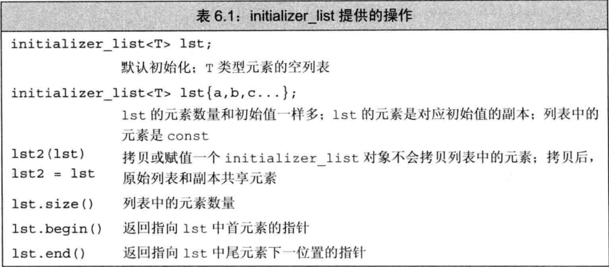
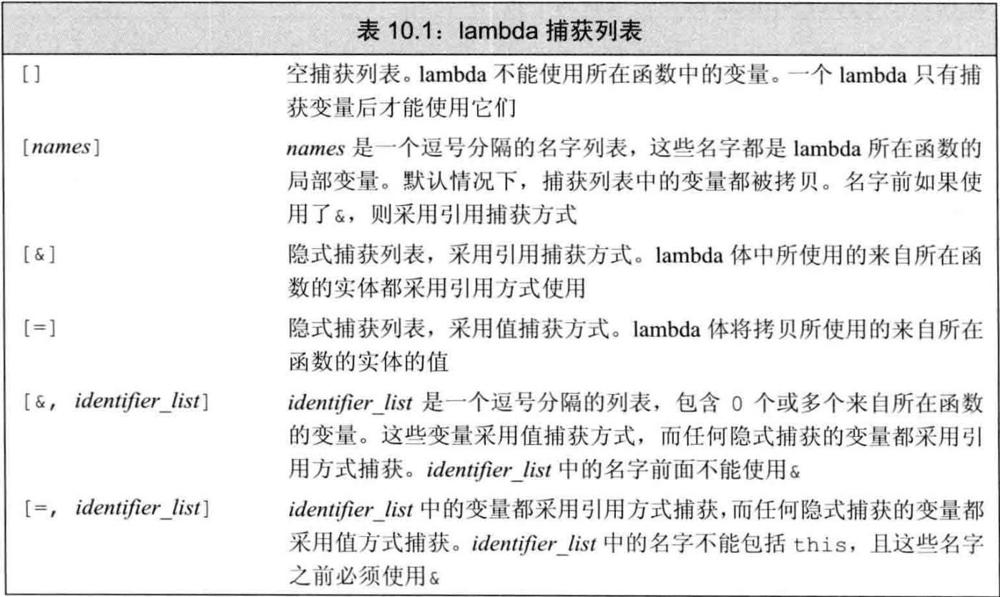

[TOC]
## 第五章 函数

### 5.1 函数基本概念介绍

函数(function)是C++中派生类型中的一种，它是指一个有名字的代码块(复合语句)，我们可以通过调用该函数来执行相应的代码，所以函数是可调用对象中的一种。一个函数有0个或多个参数，而且通常会产生一个结果。函数可以重载，也就是说同一个名字可以对应几个不同的函数。

> 函数不是变量，它是一种特殊的对象，不能被初始化和赋值。
> 不同函数对象的函数首部是独一无二的。一个函数对象的类型是由它的返回类型和形参表所决定的。

#### 5.11 函数的结构

一个函数定义通常包括以下几个部分：
* 返回类型(return type)
* 函数名字
* 形参表
* 函数体

以下是函数各部分的简介：

1. 返回类型是指该函数调用后所返回的结果类型。
2. 函数名字是一个函数的标识符，调用函数必须明确该函数的名字。
    > 在同一作用域中，函数名字能够和非可调用对象的对象名或者类型名重名
3. 形参表是指由0个或多个形参(parameter)组成的列表，每个形参都是由该形参类型与其形参名组成，形参之间要用逗号分隔。该列表必须是由圆括号括起的。
4. 函数体是一个复合语句，函数中的具体代码都写在里面。

> 函数的函数体中不能定义函数或函数模板，但是可以声明函数。
> 函数体中既可以声明，也可以定义类类型和类模板。

函数的返回类型和形参类型不能为auto和函数类型；除此之外，函数的返回类型还不能是数组类型(但可以是数组指针类型)。

形参是指函数在形参表里所声明的非静态局部变量，所有形参的作用域是从该形参声明表达式开始到所属函数的声明或定义的末尾。
所以一个函数的形参与其函数体的作用域中的局部变量之间，函数的形参与形参之间都不能重名。
形参的作用是能够在调用函数时向该函数传递数据。

> 形参名是可选的，但是由于我们无法使用未命名的形参，所以函数的形参一般都应该有个名字。

> 返回类型和形参类型都可以包含各种类型修饰符，如const等，但是都不能包含存储类说明符。
> 但是函数本身可以用存储类说明符来指定储存类型，比如`static void prints() {}`指的是一个文件内函数，文件外无法被引用。

#### 5.12 函数的声明

函数声明也称作函数原型（function prototype）。和其他名字一样，函数的名字也必须在使用之前声明。类似于变量，函数只能定义一次，但可以声明多次。

函数的声明无须函数体(有函数体就是定义了)，因为不含函数体，所以函数形参名不必与定义中相同，甚至还可以不用写形参名。

##### 5.121 函数声明形式

以下是函数的声明：
> * 返回类型 函数名字 形参表;
> * auto 函数名字 形参表 -> 返回类型;

这两种声明形式都一样，只不过第二种形式是在C++11新标准中新增的，叫做用尾置返回类型(trailing return type)。

##### 5.122 尾置返回类型

尾置返回类型和普通返回类型的最大区别也就是:
尾置返回类型在形参声明之后，所以可以用函数形参来自动推断该函数的返回类型；而普通返回类型是在形参声明之前，所以就不能这样做。

```c++
// 普通返回类型
// 错误：形参val和val2还未声明
decltype(val + val2) prints(double val, int val2);
// 尾置返回类型
// 正确：形参val和val2在返回类型之前已声明
auto prints(double val, int val2) -> decltype(val + val2);
```

> 在尾置返回类型中，对于存储说明符和除了指针、引用、数组和`const`类型限定符的其他类型限定符(如`constexpr`，`virtual`等)，这些符号必须要放在`auto`之前，否则出错。

##### 5.123 函数首部

返回类型、函数名字和形参表共同形成了一个部分，叫做函数首部。
所以一个函数声明也就是声明了一个函数首部。一个函数首部说明了调用该函数所需的全部信息，不同的函数的函数首部都是独一无二的。

> **注意**：函数首部的==形参不能用constexpr进行修饰==，constexpr只能用于函数或者非形参或静态数据成员变量的声明与定义。

要注意函数的声明要与其定义一致，就是函数首部要一致(包括函数声明或定义前的类型限定符也要一致)：
* 函数名要相同。
* 返回类型(可以忽略顶层const)要相同。
* 形参表中的形参数量，顺序和类型(可以忽略顶层const)都要相同。

否则就变成了其他的函数的声明，无意义了。

```c++
const int ret(const int val);
// 错误定义：不是同一个函数
int ret(int val) { return val;};
// 正确定义
const int ret(const int val) { return val;};
```

#### 5.13 函数的定义

函数的定义和函数声明类似，只不过需要写上函数体。

> 函数不能在函数中定义，但是可以在函数中声明。

##### 5.131 函数定义形式

函数的定义形式和声明形式一样，分两种：
> * 返回类型 函数名字 形参表 函数体
> * auto 函数名字 形参表 -> 返回类型 函数体

```c++
// val 的阶乘是 val* (val - 1) * (val - 2) .. .* ( (val - (val - 1) ) * 1) 
int fact(int val)
{
    int ret = 1； //局部变量，用于保存计算结果
    while (val > 1)
        ret *= val--; //把ret和val的乘积賦给ret,然后将val减1
    return ret； //返回结果
}
```

> 函数的声明和定义中，函数形参表与函数名字、函数体和箭头符(->)之间可以有0个或多个空白符分隔。
> 函数的声明和定义中，返回类型与函数体之间可以有0个或多个空白符分隔。
> 函数形参表中每个形参与逗号或者圆括号之间可以有0个或多个空白符分隔。

不管是函数的声明还是定义，函数的形参列表可以为空，但是不能省略，也就是必须要有一对圆括号，空形参列表的声明形式为：
> * 返回类型 函数名字 ();
> * 返回类型 函数名字 (void);

第二种形式是C语言形式，C++也继承了。

##### 5.132 已删除函数

所有函数都有一种特殊的定义形式，可以将其定义为删除的函数，这种形式就是在函数声明的后面加上赋值符`=`和关键字`delete`：
> 函数的声明 = delete;

当一个函数被定义成已删除时，是不能调用该函数的，否则会编译错误。

> 要注意已删除函数是已经定义的函数，所以不能为已删除函数再定义了，否则会重复定义。

```c++
// 定义了一个已删除函数
void prints() = delete;
// 错误：不能重复定义
void prints() { cout << "print\n"; }
// 错误：不能调用已删除函数。
prints();
```

#### 5.14 函数的使用

我们可以通过调用运算符(call operator)来执行函数。形式为：

> 函数名 (实参表)

调用运算符`()`内是实参(argument)列表(实参表最外边不能有圆括号)，实参是我们用来初始化函数形参的对象(包括临时对象)，实参可以是任何非声明或定义表达式。

> 调用运算符和函数、其他表达式之间可以有0个或多个空白符分隔。
> 函数实参表中每个实参与逗号或者圆括号之间可以有0个或多个空白符分隔。
> 函数形参表中每个形参与逗号或者圆括号之间可以有0个或多个空白符分隔。

调用函数时，该函数一般会返回一个对象(包括临时对象)，该对象的类型就是此函数的返回类型。

```c++
int main()
{
    int j = fact (5) ; // j 等于 120，即 fact (5)的结果
    cout « "5! is " « j « endl; 
    return 0;
}
```

> 实参可以是函数调用。
> 如果想传一个实参但是又不想先建立对应类型的对象，可以在实参表里隐式或者显式调用(用圆括号或者花括号加参数调用)对应类型的构造函数来创建一个临时对象来进行传递。

实参的数目通常要与其调用函数的形参数目一致，而且每个实参的位置要与形参的位置一致。也就是第一个实参初始化第一个形参，第二个实参初始化第二个形参，以此类推。

> 实参的类型必须与对应的形参类型一样或者能隐式转换成对应形参的类型。

> 尽管实参与形参存在对应关系，但是并没有规定实参的求值顺序。

```c++
fact("hello"); //错误：实参类型不正确 
fact(); //错误：实参数量不足 
fact(42, 10, 0); //错误：实参数量过多 
fact(3.14); //正确：该实参能转换成int
```

#### 5.15 函数调用的执行过程

* 用实参初始化函数对应的形参。
* 将控制权转移给被调用函数。此时，主调函数(calling function)的执行被暂时中断，被调函数(called function)开始执行。
* 被调函数执行的第一步是（隐式地）定义并初始化它的形参。
* 然后执行被调函数函数体中的代码，直到遇到return语句或者到达函数体末尾。
* 当遇到一条return语句或者到达函数体末尾时，函数结束执行过程，并将控制权从被调函数转移回主调函数，继续执行调用点以及调用点之后的代码。
* 如果是遇到return语句才结束的，那么还会返回return语句中的值（如果有的话），该返回值用于初始化调用表达式的结果。

### 5.2 函数分类

函数按照作用分，可分为：
* 普通函数
* 递归函数
* 内联函数
  * constexpr函数

> 内联函数、constexpr函数和普通函数一样都可以只声明不定义，只要不用就行。

#### 5.21 递归函数

如果一个函数调用了它自身，不管这种调用是直接的还是间接的，都称该函数为递归函数(recursive function)。

```c++
//计算val的阶乘，即1*2*3...* val
/* 我们递归地调用factorial函数
以求得从val中减去1后
新数字的阶乘。
当val递减到1时，递归终止，返回1。
*/
int factorial(int val)
{
    if (val > 1)
        return factorial(val-1) * val;
    return 1;
}
```

> 当某递归函数运行时，每次都递归调用却没有终止条件时，这种函数就被说明其含有递归循环(recursion loop)。

所以当定义一条正常的递归函数时，一定有某条路径是不包含递归调用的；否则，函数将“永远”递归下去。换句话说，函数将不断地调用它自身直到程序栈空间耗尽为止。

#### 5.22 内联函数

函数调用的执行过程中，每次调用一个函数，都是要在内存空间上开辟一个临时空间(栈区)来存放该函数的数据，调用结束后释放其临时空间。所以函数调用一般比求等价表达式的值要慢一些。

所以当我们定义一个简单的函数时，为了节省程序运行时间和空间，可以将其指定为内联函数(inline)。
内联函数的定义形式为：
> inline 函数定义

内联函数是指将函数在它在每个调用点上“内联地”展开：

```c++
inline const string SshorterString(const string &s1, const string &s2)
{return s1.size() <= s2.size() ? s1 : s2}

// 在编译过程中展开成类似于下面的形式:\
cout << (s1.size() <= s2.size() ? s1 : s2) << endl;
cout << shorterString (s1, s2) << endl;
```

内联说明只是向编译器发出的一个请求，编译器可以选择忽略这个请求。一般来说，内联机制用于优化规模较小、流程直接、频繁调用的函数。而且不要定义内联递归函数，很多编译器都不支持内联递归函数。

> 同一文件的同一个函数的声明和定义语句中是否含有关键字inline可以不一致，==以函数的定义语句为主==。

内联函数因为其性质，所以可以在将要链接的各个不同文件中都定义其函数。

调用该内联函数的调用点所使用的函数，是调用点对应文件里的该函数的定义版本，如果调用点对应文件里只有该函数的声明而没有定义，则会出错。
所以对于内联函数来说，要在每个文件中都有其定义。

> 同一个内联函数在不同文件的定义应保持一致，尤其是函数首部一致，防止定义成了其他的内联函数，无意义了。

#### 5.23 constexpr函数

constexpr函数之前也谈过，是指能用于初始化或赋值常量表达式的函数。

定义constexpr函数的形式与其他函数一样，不过要遵循以下约定：
* 函数的返回类型及所有形参的类型都得是字面值类型(所以该函数的返回类型不能为void)。
* 函数体中必须有且只能有一条return语句。

定义形式为：
> constexpr 函数定义

```c++
constexpr int new_sz() { return 42; }
constexpr int foo = new_sz (); // 正确：foo 是一个常量表达式
```

编译器一般是把对constexpr函数的调用转换成其结果值。
为了能在编译过程中随时展开，==constexpr函数被隐式地指定为内联函数==，所以和内联函数一样，要在多个不同文件中都定义其函数。

> 同一文件的同一个constexpr函数的声明和定义语句都必须含有关键字constexpr，否则会编译出错。

constexpr函数体内也可以包含其他语句，不过必须为以下几种：
1. 空语句、空复合语句和只含有空语句的复合语句。
2. 类型别名定义。
3. 命名空间别名定义以及命名空间相关的using操作等。

constexpr函数的返回值可以不是一个常量表达式，当constexpr函数的所有实参都是常量表达式时，且它的return语句里的表达式也是常量表达式时，该函数的返回值才是常量表达式，否则返回值就不是常量表达式。

```c++
int no_c1 = 88;
// 非constexpr函数
int get_no_c(int num) {return num;}
constexpr int get_cstex1(int num1, int num2) 
{ return num1; }
// return语句总为非常量表达式的constexpr函数get_cstex2
constexpr int get_cstex2(int num1, int num2) 
{ return no_c1; }
// 定义两个非常量表达式。
int nc_num1 = 5;
const int cc1 = get_no_c(5);

// 错误：nc_num1为非常量表达式，所以返回的不是常量表达式。
constexpr int cst_num1 = get_cstex1(5, nc_num1);
// 错误：return语句的表达式为非常量表达式，所以返回的不是常量表达式。
constexpr int cst_num2 = get_cstex2(5, 6);
// 错误：cc1是常量，但不是常量表达式，所以返回的不是常量表达式。
constexpr int cst_num3 = get_cstex1(cc1, 6);
// 正确：cst_num4初始化为5。
constexpr int cst_num4 = get_cstex1(5, 6);
```

### 5.3 函数参数详解

如前所述，每次调用函数时都会重新创建它的形参，并用传入的实参对形参进行初始化。

> 形参初始化的机制与变量初始化一样。

#### 5.31 参数传递分类

和其他变量一样，形参的类型决定了形参和实参交互的方式，一般来说，参数的传递可以分为两种：

* 值传递
* 引用传递

##### 5.311 值传递

当实参的值被拷贝给形参时，形参和实参是两个相互独立的对象。我们说这样的实参被值传递(passed by value)或者函数被传值调用(called by value)；也就是说，形参和实参的内存地址不一样，只是两个值一样。

```c++
//该函数接受一个指针，然后将指针所指的值置为0
void reset(int *ip)
{ 
   *ip = 0; //改变指针ip所指对象的值
   ip = 0; //只改变了ip的局部拷贝，实参未被改。
}
int i = 42;
reset (&i); //改变i的值而非i的地址
cout << "i = " << i << endl; // 输出 i = 0。
```

##### 5.312 引用传递

当形参是引用类型时，我们说它对应的实参被引用传递(passed by reference)或者函数被传引用调用(called by reference)。和其他引用一样，引用形参也是它绑定的对象的别名；也就是说，引用形参是它对应的实参的别名(形参和实参的内存地址一样)。

```c++
//该函数接受一个引用，然后将指针所指的值置为0
void reset(int &i)
{
   i = 0; //改变了 i所引对象的值
}
int j = 42;
reset (j); // j采用传引用方式，它的值被改变
cout << "j = " << j << endl; // 输出 j = 0。
```

> 要改变所传的实参值、或者有些大的类类型对象以及容器对象在拷贝时比较低效，甚至有的类类型(比如IO类)根本就不支持拷贝操作。此时用引用传递是最好的。

> 如果函数无须改变引用形参的值，最好将其声明为常量引用。

#### 5.32 默认实参

当函数的某个形参经常会被用同一个值初始化，我们又不想每次调用都要自己传递这个常用值时，我们就可以对该形参设置默认实参。
所以默认实参的作用就像上面说的，简化调用操作。

默认实参作为形参的初始值，可以是任意非声明定义的表达式。
默认实参必须要出现在形参列表中。
我们可以为一个或多个形参定义默认实参(传值和传引用形参都能有)。

不过需要注意的是，一旦某个形参被赋予了默认实参，它后面的所有形参都必须有默认实参，也就是有默认实参的形参要放在形参表末尾。

> 默认实参不能是使用该默认实参的函数本身的调用，否则会出错。
> 但是可以是该函数名相同的函数的调用(也就是可以调用该函数的重载)，此时该默认实参是不会匹配到自己所属的那一个函数。

##### 5.321 默认实参的形参表形式

有默认实参的形参表的形式为：
> (形参类型1 形参名1 = 默认实参1, 形参类型2 形参名2 = 默认实参2, 形参类型3 形参名3 = 默认实参3, ...)

```c++
typedef string::size_type sz;
string screen(sz ht = 24, sz wid = 80, char backgrnd = '');
```

> 函数形参只能用拷贝初始化来设定默认实参(也就是必须要有赋值符`=`)，用不了直接初始化。

> 当形参为类类型时，如果想用此形参类型的默认构造函数来生成一个临时对象来当做该形参的默认实参，则应该在赋值符`=`后加空花括号来调用默认构造函数(注意不能用空圆括号)。

函数的==局部变量，包括其他形参都不能作为该函数的默认实参==，除此以外，只要表达式的类型能隐式转换成形参所需的类型，就能作为该形参的默认实参。

对于函数声明来说，和函数定义一样，默认实参可以用在函数声明中，在同一个的作用域中同一个函数的一个形参只能被赋予一次默认实参。换句话说，函数的后续声明只能为之前那些没有默认值的形参添加默认实参，此时该后续声明的默认实参可以不在形参表末尾。

```c++
typedef string::size_type sz;
string screen(sz ht, sz wid, char backgrnd);
// 正确，表示高度和宽度的形参没有默认值
string screen(sz, sz, char = '' );
// 错误，我们不能修改一个已经存在的默认值
string screen(sz, sz, char = '' ); // 错误：重复声明。
// 正确，可以按照如下形式添加默认实参：
string screen (sz = 24, sz = 80, char); // 正确：添加默认
```

> 和普通函数声明一样，有默认实参的函数声明也可以不用写形参名字。

> 每个调用点调用的函数的默认实参是按照当前调用点所有可见的该函数的声明和定义的默认实参的组合(包含其他文件中该函数的声明或定义)。

##### 5.322 含默认实参函数的使用

如果我们想使用默认实参，只要在调用函数的时候省略该实参就可以了，不使用时就按正常方式的调用写上实参就行。

> 我们只能省略有默认实参的形参的实参，没有默认实参的一律不能省略，否则出错。

函数调用时实参按其位置解析，默认实参负责填补函数调用缺少的尾部实参(靠右侧位置)。

```c++
typedef string::size_type sz;
string screen(sz ht = 24, sz wid = 80, char backgrnd = '');
string window;
// 等价于 screen(24,80,'')
window = screen();
// 等价于 screen(66, 80,'')
window = screen (66);
// screen(66,256,'')
window = screen(66, 256);
// screen(66,256,'#')
window = screen(66, 256, '#');

//错误：只能省略尾部的实参
window = screen(, , '?');
window = screen('?'); // 调用 screen ('?', 80, '')
```

#### 5.33 可变形参的函数

有时我们无法提前预知应该向函数传递几个实参。
为了编写能处理不同数量实参的函数，一共有三种方法：
* 如果所有的实参类型相同，可以用一个名为`initializer_list`的标准库类型
* 如果实参的类型不同，我们可以
  * 用一种特殊的形参类型（即省略符），不过这种功能一般只用于与C函数交互的接口程序。 
  * 用可变参数模板来进行传递

可变参数模板将在之后的模板一章中介绍。

##### 5.331 initializer_list形参

如果函数的实参数量未知但是全部实参的类型都相同，我们可以使用`initializer_list`类型的形参。
`initializer_list`类型定义在同名的头文件中，它是一种标准库类型，用于表示某种特定类型的值的数组。



`initializer_list`类型是类模板类型，`initializer_list`类型的对象中的元素是const类型，所以无法被赋值。

一个函数的形参表可以有多个`initializer_list`形参，在含有`initializer_list`形参的函数也可以同时拥有其他形参。
`initializer_list`形参可以放在形参表的任何位置，也能有默认实参。

###### 5.3311 initializer_list形参的形参表形式

有`initializer_list`形参的形参表的形式示例：
> (initializer_list<基本类型1> 形参1, 形参类型2 形参2, initializer_list<基本类型2> 形参3, ···)

```c++
void error_msg(initializer_list<string> il, string ex_msg)
{
    for (auto beg = il.begin(); beg != il.end(); ++beg)
        cout << *beg << " ";     
    cout << "\n" << ex_msg << endl;
}
```

###### 5.3312 含initializer_list形参的使用

当要传递实参到`initializer_list`形参时，该实参必须是由==花括号括起来的0个或多个值的序列==，这些值的类型要与`initializer_list`形参的基本类型一致或者能隐式转换成该基本类型。

```c++
void error_msg(initializer_list<string> il, string ex_msg)
{
    for (auto beg = il.begin(); beg != il.end(); ++beg)
        cout << *beg << " ";     
    cout << "\n" << ex_msg << endl;
}

// 错误：没有花括号，实参不匹配
error_msg("error","function", "undefined", "line_58");
// 正确：输出：
// error function undefined
// line_58
error_msg({"error","function", "undefined"}, "line_58");
```

> `initializer_list`形参对应的实参可以为空，但是必须要有花括号。

##### 5.332 省略符形参

省略符形参是为了便于C++程序访问某些特殊的C代码而设置的，这些代码使用了名为`varargs`的C标准库功能。

> 省略符形参应该仅仅用于C和C++通用的类型，特别应该注意的是，大多数类类型的对象在传递给省略符形参时都无法正确拷贝。

###### 5.3321 省略符形参的形参表形式

省略符形参只能出现在形参列表的最后一个位置，且该位置的这一项只能有一个省略符`...`，不能含有形参类型与形参名。

有省略符形参的形参表的形式为：
> (形参类型1 形参名1, 形参类型2 形参名2(可选`,`)...)

省略符形参与前一个形参名之间的逗号`,`可有可不有，等价。

```c++
/*以下都为正确的声明*/
void test(int, double, ...);
void test(int, double ...);
void test(int...);
void test(...);
```

> `initializer_list`形参可以和省略符形参一起使用，只要遵守各自的规则就行。

###### 5.3322 含省略符形参的使用

省略符形参接受0个或多个实参，当调用一个含有省略符形参的函数时，实参的数目必须要大于等于减去了省略符形参的形参数目。多余的实参都传递给了省略符形参，因为编译器不对省略符对应的实参进行类型检查，因此省略符对应的实参类型可以是任意不同类型的。

> 省略符符号不能当做函数的实参。

```c++
void test(int, double, ...) {}
void test2(...);

int main()
{
    char ins = 'g';
    // 调用错误，实参数目不能小于减去了省略符形参的形参数目
    test(2);
    // 调用错误， 省略符符号不能当做函数的实参
    test(2, 3.55, ...);
    // 调用正确，省略符对应的实参类型可以是任意不同类型的
    test(-8, 4.15, 6, &ins, "string");
    // 调用正确，省略符形参可以接受0个实参。
    test2();
}
```

#### 5.34 特殊类型形参分析

函数形参的类型可以是各种类型，但是有几种类型比较特殊，接下来就来讲解这几种特殊类型的形参：
* const形参
* 数组形参
* 函数形参
* main函数形参

##### 5.341 const形参

当某个形参的类型为const时，它的初始化规则和普通的const变量一样：

(顶层const/非顶层const)实参能初始化(非顶层const/顶层const)形参；而底层const实参不能为非底层const形参初始化。

##### 5.342 数组形参

对于数组形参，我们可以写成三种形式：
* 数组形式
* 数组指针形式
* 数组引用形式

因为数组会被转换成指针，所以当我们为函数传递一个数组名时，实际上传递的是指向数组首元素的指针。

###### 5.3421 数组形式和数组指针形式形参

我们可以将形参写成以下几种的形式：
* 数组形式
  > 类型说明符 (可选 类型修饰符) (可选 形参名) 维度
* 指向数组首元素的指针形式
  > 类型说明符 (可选 类型修饰符) (可选 形参名) *
  > 或
  > 类型说明符 (可选 类型修饰符) *(可选 形参名) 维度

数组形式中第一维度的大小可以省略，但是符号`[]`不能省略。

> 数组形式的形参可以像数组一样用下标运算符来访问该形参的元素；而数组指针形式的不行。

> 当我们用数组形式定义多维数组形参时，编译器会一如既往地忽略掉第一个维度，所以最好不要把它包括在形参列表内。

```c++
//matrix的声明看起来\
是一个二维数组，实际上形参是指向含有10个整数的数组的指针。
void print(int matrix[][10], int rowSize) { /* ... */}
```

```c++
//尽管形式不同，但这三个print函数是等价的//每个函数都有一个const int*类型的形参
void print(const int*);
void print(const int[]); //可以看出来，函数的意图是作用于一个数组
void print(const int[10]); //这里的维度表示我们期望数组含有多少元素，实际不一定。
```
```c++
int i = 0, j[2] = {0, 1};
print(&i); //正确：&i的类型是int*。
print(j); //正确：j转换成int*并指向j[0]。
```

###### 5.3422 数组引用形式形参

C++语言允许将变量定义成数组的引用，基于同样的道理，形参也可以是数组的引用。此时，引用形参绑定到对应的实参上，也就是绑定到数组上。
形式为:
> 类型说明符 (可选 类型修饰符) (&(可选 形参名)) 维度

符号`[]`不能省略。
维度的大小也不能省略，因为省略维度的类型无法匹配到其他任何数组（因为其他的数组都有维度，维度不一样匹配不了）。

```c++
//错误：虽然能编译通过，但是arr不能接收数组，因为没指定维度的大小
void print2(int (&arr)[])
{
    for (auto elem : arr) cout << elem << endl;
}
int k[10] = {0,1,2,3,4,5,6,7,8,9};
int k2[] = {0,1,2};
/**
  错误：print2接受的变量类型为int (&)[]，而k的类型则为int (&)[10]，维度不一样不能匹配。
*/
print2(k);
/**
  错误：print2接受的变量类型为int (&)[]，而k2的类型则为int (&)[3]，维度不一样不能匹配。
*/
print2(k2);
```

> 和数组形式的形参一样，数组引用形参也可以像数组一样用下标运算符来访问该形参的元素。

> 形参名两端的括号必不可少，否则就成了引用的数组了。

```c++
//正确：形参是数组的引用，维度是类型的一部分
void print(int (&arr)[10])
{
    for (auto elem : arr)cout << elem << endl;
}
//错误：虽然能编译通过，但是arr不能接收数组，因为没指定维度的大小
void print2(int (&arr)[])
{
    for (auto elem : arr)cout << elem << endl;
}

int i = 0, j[2] = {0, 1};
int k[10] = {0,1,2,3,4,5,6,7,8,9};
print(&i); //错误：实参不是含有10个整數的数组。
print(j); //错误：实参不是含有10个整数的数组。
print(k); //正确：实参是含有10个整数的。
/**
  以下都错误：因为print2不能接受数组。
*/
print2(&i); 
print2(j);
print2(k);
```

##### 5.343 函数形参

之前说过，函数形参不能为函数类型，但是可以是函数指针类型。

当我们把函数名作为一个值使用时，该函数名会自动地转换成指针，所以我们形参类型可以类似于函数。

```c++
//第三个形参是函数类型，它会自动地转换成指向函数的指针
void useBigger(const string &s1, const string &s2,bool pf(const string, const string &));
//等价的声明：显式地将形参定义成指向函数的指针
void useBigger(const string &s1, const string &s2,bool (*pf)(const string &, const string &));

//自动将函数lengthCompare转换成指向该函数的指针
useBigger(s1, s2, lengthCompare);
```

##### 5.344 main函数形参

main函数是c++里的主函数，每个程序必须要有这个程序，操作系统时通过调用该函数来运行程序的。

> main函数不能被其他函数或者是自己所调用。

一个程序中有且只有一个全局的main函数。

一般情况下main函数的形参表为空，但是有时我们确实需要给main传递实参。

所以main函数有两个可选的形参：
* 第一个形参必须是```int```型，表示的是第二个形参所表示的数组中元素的数量。
* 第二个形参必须是```char (*)[]```型或```char **```，表示的是一个元素都为指向字符串类型的指针的数组。

所以main函数的定义形式为：
> int main((可选 int 形参名1, char(*形参名2)[])) 函数体
> 
> int main((可选 int 形参名1, char\*\* 形参名2)) 函数体

> main函数形参表要么为空，要么有规定的这两个形参(缺一不可)，其他情况编译器一律警告。

> main函数形参可以有默认实参。

一种常见的情况是用户通过设置一组选项来确定函数所要执行的操作。
如在含有main函数的exe文件(prog.exe)的路径中向命令行输入```\prog -d -o ofile data0```，就可以向文件(prog.exe)里的main函数传递所输入的参数了。

当实参传给main函数之后，第二个形参中的第一个元素是指向程序的名字或者一个空字符串，接下来的元素依次传递命令行提供的实参。最后一个指针之后的元素值保证为0。

```c++
// 向命令行输入
// \prog -d -o ofile data0
int main(int argc, char *argv[])
{
    // 输出prog。或者也可以指向一个空字符串，为空。
    cout << argv[0];
    // 输出-d
    cout << argv[1];
    // 输出-o
    cout << argv[2];
    // 输出ofile
    cout << argv[3];
    // 输出data0
    cout << argv[4];
    // 输出0
    cout << argv[5];
    return 0;
}
```

> 所以当使用argv中的实参时，一定要记得可选的实参从元素1开始，元素0保存程序的名字，而非用户输入。

### 5.4 函数返回过程详解

之前说过是指该函数调用后所返回的结果类型，所有函数都需要一个return语句来指定返回的值。

#### 5.41 return语句

return语句是专用于函数中的一种跳转语句。
return语句的作用是终止当前在执行的函数并将控制权返回到调用该函数的地方，有可能会返回一个值到调用点。

##### 5.411 return语句的形式

return语句有两种形式：
> return;
> return 表达式;

return语句的第一种形式只能用于返回类型为void的函数中，该形式不返回任何值。

但是返回类型为void的函数并不要求非得有return语句，因为在这类函数的最后一句后面会隐式地执行```return;```
返回类型为void的函数也能使用第二种形式，不过此时return语句的表达式必须是返回void的函数的调用，否则出错。

return语句的第二种形式可以用于所有返回类型不为void的函数中，该形式会返回所给的表达式的求值结果。
该求值结果要与其==对应函数的返回类型相同，或者能隐式地转换成对应函数的返回类型==，否则出错。

> return语句能出现在函数的任何位置，一个函数中的return语句数量没有限制，但所有的return语句都要符合上面的规则。

> 当非void函数的控制流有可能未返回任何值时就结束了运行，有些编译器会检测出来这种错误，并予以警告

> 除了constexpr函数，其他所有函数的函数体中都可以没有return语句，编译器会在函数结束时自动返回一个对应类型的未定义对象。
> 所以对于返回类型为非void的函数来说，如果没有return语句，编译器会警告。

```c++
//因为含有不正确的返回值，所以这段代码无法通过编译
bool str_subrange(const string &strl, const string &str2)
{
//大小相同：此时用普通的相等性判断结果作为返回值
if (strl.size() == str2.size())
return strl == str2; //正确：==运算符返回布尔值
//得到较短string对象的大小
//检查两个string对象的对应字符是否相等，以较短的字符串长度为限
auto size = (strl.size() < str2.size()) ? strl.size() : str2.size();
for (decltype(size) i = 0; i != size; ++i) {
if (strl[i] != str2[i])
return; //错误#1:没有返回值，编译器将报告这一错误
//错误#2：控制流可能尚未返回任何值就结束了函数的执行 
//编译器可能检查不出这一错
```

##### 5.412 return语句的执行过程

当程序运行到一个return语句时，会算出该return语句后的结果并进行类型检查，无误后被调函数终止，并返回这个结果值。程序返回到调用点，此时调用函数的表达式的结果就是该结果值。

被调函数返回的结果会根据其函数的返回类型而不同，一般返回形式和参数传递一样，分为两种：
* 返回值
* 返回引用

根据函数的返回形式，其返回过程分为以下两种：
* 返回值
  * 如果return语句的表达式的结果是一个临时对象或者是该函数自己定义的非静态局部变量，则将该对象直接返回到调用点(不再生成其他临时对象)，作为函数调用的结果。
  * 如果return语句的表达式的结果是既不是临时对象也不是该函数自己定义的非静态局部变量，则调用点生成一个临时的与被调函数的返回类型一样的对象，然后这个return语句的表达式结果用于初始化该临时对象，该临时对象就作为函数调用的结果。
* 返回引用
  * 直接将return语句的表达式结果返回(不管结果是局部变量、临时对象还是非局部变量等，都一律直接返回)到调用点(不再生成其他临时对象)，作为函数调用的结果。

###### 5.4121 返回值

函数的返回类型不是引用类型时，该函数的返回就是返回值，所以该函数调用的表达式的值为右值。

函数返回过程中，返回值的方式是在调用点生成一个临时的与被调函数的返回类型一样的==对象==。

###### 5.4122 返回引用

当函数的返回类型是引用类型时，该函数的返回就是返回引用，所以该函数调用的表达式的值为左值。

函数返回过程中，返回引用的方式是在调用点生成一个临时的与被调函数的返回类型一样的==引用==。

> 当函数的返回类型为引用或指针时，return语句里的表达式的结果不能是非静态局部变量或者是非静态局部变量的地址。
> 因为函数完成后，它所占用的存储空间也随之被释放掉。因此，函数终止意味着非静态局部变量不再存在。

```c++
//严重错误：这个函数试图返回局部对象的引用
const string &manip()
{
    string ret;
    //以某种方式改变一下ret
    if (!ret.empty())
        return ret; // 错误：返回局部对象的引用！
    else
        return "Empty"; //错误："Empty"是一个局部临时量
}
```

#### 5.42 特殊返回类型分析

函数返回类型可以是各种类型，但是有几种类型比较特殊：
* 数组返回类型
* 函数返回类型
* main函数返回类型

##### 5.421 数组返回类型

之前说过，函数的返回类型不能为数组类型，但是可以为数组指针类型。

> 当数组作为函数的返回类型时，不会隐式转换成数组指针类型的，所以我们必须显式将返回类型指定为指针。

##### 5.422 函数返回类型

之前说过，函数的返回类型不能为函数类型，但是可以为函数指针类型。

> 当函数作为函数的返回类型时，不会隐式转换成函数指针类型的，所以我们必须显式将返回类型指定为指针。

##### 5.423 main函数返回类型

main函数的返回类型必须为int。

虽然main函数的返回类型为int，但是我们允许main函数没有return语句直接结束。
如果程序到达了main函数的结尾处而且没有return语句，则编译器将隐式地插入一条返回值为0的return语句。

当然我们也可以自己手动加。一般该函数的return语句在该函数的最后一句，且return返回值为0。

main函数的返回值可以看做是状态指示器。返回0表示执行成功，返回其他值表示执行失败，其中非0值的具体含义依机器而定。

为了使返回值与机器无关，`cstdlib`头文件定义了两个顶处理变量(`EXIT_SUCCESS`, `EXIT_FAILURE`)，我们可以使用这两个变量分别表示成功与失败。

```c++
int main()
{
    if (some_failure)
        return EXIT_FAILURE;  // 定义在cstdlib头文件中。
    else
        return EXIT_SUCCESS; // 定义在cstdlib头文件。
}
```

### 5.5 函数重载

如果冋一作用域内的几个函数名字相同但形参表不同，我们称之为重载(overloaded)函数。这些函数接受的形参类型不一样，但是执行的操作非常类似。当调用这些函数时，编译器会根据传递的实参类型推断想要的是哪个函数。

形参表的不同有以下两点：
* 两个形参表中形参数量不同。
* 两个形参表中至少有一个形参的类型不同
* 如果两个形参表中的形参的数量，类型相同，但是至少有一个形参的相对顺序不同。

```c++
void print(const char *cp);
void print(const int *beg, const int *end);
void print(const int ia[], size_t size);

int j[2] = {0, 1};
print("Hello World"); // 调用 print(const char*)
print(j, end(j)-begin(j)); // 调用print(const int*, size_t)
print(begin(j), end(j)); // 调用print(const int*, const int*)
```

> 名字不同的函数，就算其他部分完全相同，也不是同一个函数。

> main函数不能重载。

#### 5.51 函数重载与重复定义

函数重载不是重复定义，只要满足了函数重载的规则：形参表的不同。定义的函数就是名字相同的另一个函数。

以下这几种特征的不同不会满足函数重载的要求，所以会导致重复定义：
* 形参名不同
* 返回类型不同
* 类型别名形参
* 顶层const形参
* constexpr修饰符

##### 5.511 形参名不同

形参表的不同与形参名无关，形参名与函数重载无关。

```c++
//每对声明的是同一个函数
Record lookup(const Account &acct) {}
Record lookup (const Accounts) {} // 省略了形参的名字
```

##### 5.512 返回类型不同

要注意如果两个函数除了返回类型外，其他所有的要素都相同的，那么是属于同一个函数，会导致重复定义。

```c++
Record lookup(const Accounts) {}
bool lookup (const Account&) {} //错误：与上一个函数相比只有返回类型不同
```

##### 5.513 类型别名形参

用类型别名的类型和源类型算同一个类型。

```c++
typedef Phone Telno;
Record lookup(const Phone&) {}
Record lookup (const Telno&) {} // Telno和Phone的类型相同。
```

##### 5.514 顶层const形参

一个拥有顶层const的形参无法和另一个没有顶层const的形参区分开来。

```c++
Record lookup(Phone) {}
Record lookup (const Phone) {} // 重复声明了Record lookup(Phone)

Record lookup(Phone*) {}
Record lookup (Phone* const) {} // 重复声明了Record lookup(Phone*)
```

> 但是如果形参是底层const，则可以实现函数重载。

```c++
//对于接受引用或指针的函数来说，\
对象是常量还是非常量对应的形参不同
//定义了4个独立的重载函数
Record lookup (Account&) {} //函数作用于Account的引用。
Record lookup (const Account&) {} // 新函数，作用于常量引用
Record lookup (Account*) {} // 新函数，作用于指向Account的指针。
Record lookup (const Account*) {} //新函数，作用于指向常量的指针。
```

##### 5.515 constexpr修饰符

两个函数的定义只有constexpr修饰符不同会被认定为重复定义。

```c++
// constexpr函数
constexpr int GetInt(int obj) {}
// 普通函数，但constexpr函数与其重复定义
// 会编译错误
int GetInt(int obj) {}
```

#### 5.52 函数匹配

定义了一组重载函数后，我们需要以合理的实参调用它们。

函数匹配(function matching)是指一个过程，在这个过程中我们把函数调用与一组重载函数中的某一个关联起來，函数匹配也叫做重载确定(overload resolution)。

编译器首先将调用的实参与重载集合中每一个函数的形参进行比较，然后根据比较的结果决定到底调用哪个函数。

根据重载集合中每一个函数形参的匹配度，调用重载函数时有三种可能的结果：
* 最佳匹配(best match)
* 无匹配(no match)
* 二义性调用(ambiguous call)

最佳匹配：编译器找到一个与实参最佳匹配的函数，并生成调用该函数的代码。

无匹配：找不到任何一个函数与调用的实参匹配，此时编译器发出无匹配的错误信息。

二义性调用：有多于一个函数可以匹配，但是每一个都不是明显的最佳选择。此时编译器发出二义性调用的错误信息。

> 要注意函数匹配是在编译阶段进行的，只要代码中出现了某个函数的调用，编译器在编译时就会开始对该函数进行函数匹配。只有找到了最佳匹配才会通过编译，否则终止编译，输出错误信息。

```c++
#include <iostream>
#include <string>
#include <type_traits>

template<class T>
std::string sprints(const T& arg)
{
    std::string str;
    // T类型与char*相等时
    if (std::is_same<typename std::decay<T>::type, char*>::value)
        str = arg;
    else
        str = std::to_string(arg);
    return str;
}

int main(int argc, char **argv)
{
    /* 编译会出错，因为编译器在编译阶段进行sprints函数的函数匹配。
     * 模板生成的sprints实例是std::string sprints(const char*(&arg));
     * ，而std::to_string函数没有std::to_string(const char*)的重载函数
     * 因此会输出匹配不到的编译错误信息，正确方法是新建一个std::to_string(const char*)的重载函数，如下：
        namespace std
        {
        std::string to_string(const char*)
        {
            return std::string("error!");
        }
        } // End namespace std
     * 这样才会编译通过。终端输出strings
     */
    const std::string &str = sprints("strings");
    std::cout << str << std::endl;
    return 0;
}
```

##### 5.521 编译器寻找重载函数的过程

和变量一样，编译器寻找重载函数的顺序为：
* 先进行名字查找，
* 再进行类型检查。

以下是编译器在寻找重载函数过程：

1. 从调用函数的位置向上查找与其名字一样的函数的声明或定义语句。
   如果没找到，则终止程序并提示未定义函数的错误。
   > 向上查找只会找该调用点所属的作用域以及包含该调用点作用域的外层作用域，不会找里层作用域。
2. 如果==在某作用域找到了一个同名函数的声明语句，则确定了所有重载函数集合的作用域就是在这个作用域中==(也就是外层的同名函数不算重载函数集合中的函数，外层函数被隐藏)。
   将所有在这个作用域中找到的重载函数(包括只有声明，没有定义的)都当成重载函数集合的成员。
   1. 然后查找在这个作用域中所有同名函数声明所对应的定义(可以向上查找对应的定义)。
   2. 如果一个对应的定义语句都没找到，则终止程序并提示未定义函数或声明不匹配的错误。
3. 在查找函数声明对应定义的过程中，对每个找到对应定义的函数进行类型检查:
   * 检查该定义语句所在的作用域内是否存在重复的定义语句。
    如果存在，则终止程序并提示重复定义的错误；否则继续后面的操作。
4. 根据调用点的实参，对重载函数集合进行匹配。

> 因为编译器是*先进行名字查找，再进行类型检查*，所以在内外层都有同名的实体时，在非显式指定时某实体时，编译器是不会去查找外层的同名实体的，即使内层的同名实体类型不匹配也不会去查找外层的。

```c++
void prints(const string& str) { cout << str; }
void prints(int ins) { cout << ins; }
void prints(double dou) { cout << dou; }
int main()
{
    void prints(int);  // 隐藏了\
    void prints(const string& str)和\
    void prints(double dou)。
    prints("str"); // 错误：void prints(const string& str)被隐藏
    prints(3.6); // void prints(double dou)被隐藏，所以调用void prints(int)，输出3。
    prints(6); // 正确：调用void prints(int)，输出6。
}
```

##### 5.522 重载函数匹配的过程

函数匹配的过程分为三步：
* 选定本次调用对应的候选函数。
* 考察本次调用提供的实参，然后从候选函数中选出可行函数。
* 从可行函数中选择与本次调用最匹配的函数。

候选函数(candidate function)指的是重载函数集合中的函数。

候选函数有两个特征：
* 与被调用的函数同名。
* 其声明在调用点可见。

可行函数(viable function)指的是从候选函数中选出能被本次提供的实参调用的函数。
如果没找到可行函数，编译器将报告无匹配函数的错误。

可行函数也有两个特征：
* 其形参的数量必须大于或等于本次调用所提供的实参数量。大于时，其多出来的形参必须都有默认实参。
* 每个实参的类型与对应的形参类型相同，或者能隐式转换成对应的形参的类型。

最佳匹配函数是指本次提供的实参类型与该形参类型最接近的函数(比如`int`比`double`更接近`int`)，编译器依次检查每个函数的每个实参以确定哪个函数是最佳匹配。
如果没找到最佳匹配函数，编译器将报告二义性调用的错误。

最佳匹配函数也有两个特征：
* 该函数每个实参的匹配都不劣于其他可行函数需要的匹配。
* 至少有一个实参的匹配优于其他可行函数提供的匹配。

##### 5.523 最佳匹配的确定

为了确定最佳匹配，编译器将实参类型到可行函数的形参类型的接近程度划分成几个等级，以下是接近程度的具体排序，从上到下，接近程度依次降低:
1. 精确匹配，包括：
   * 实参类型和形参类型相同。
   * 实参从数组类型或函数类型转换成对应的指针类型。
   * 向实参添加顶层const或者从实参中删除顶层const。
2. 非底层const实参转换成底层const实现的匹配。
3. 通过整型提升实现的匹配。
4. 通过算术类型转换或指针转换实现的匹配。
5. 通过类类型转换实现的匹配(包括派生类向基类的转换)。

> 如果一个可行函数的实参匹配同时满足多个等级，则该函数的接近程度按照低等级来。

对于含有省略符形参的函数来说，如果该函数并不只有一个形参，则该省略符形参不会对其匹配的优先级有任何影响；但是如果该函数只有省略符这一个形参，则它的优先级比任何可行函数的优先级都要低(除了空形参表函数，该函数与其优先级一样)。

```c++
void prints(int, ...) { cout << "omission"; }
void prints(int) { cout << "common"; }
// 错误：调用二义性
prints(3);
```
```c++
void prints(...) { cout << "omission"; }
void prints(int) { cout << "common"; }
// 正确：输出common
prints(3);
```
```c++
void prints(...) { cout << "omission"; }
void prints() { cout << "common"; }
// 错误：调用二义性
prints();
```

对于属于同一接近程度的各种类型的转换，其优先级别都一样，不存在某一种比另一种的更好。
例如算术类型的转换，从`int`向`unsigned int`的转换并不比从`int`向`double`的转换级别高。

```c++
void manip(long);void manip(float);manip(3.14); //错误：二义性
```

如果两个重载函数的区别仅仅在于底层const，则当调用时，编译器通过实参是否是const类型來决定调用哪个函数。

```c++
Record lookup (Account&); // 函数的参数是Account的引用。
Record lookup (const Account&); // 函数的参数是一个常量引用。
const Account a;
Account b;
lookup(a); // 调用lookup(const Account&)。
lookup(b); // 调用lookup(Account&)。
```

### 5.6 可调用对象

C++中的可调用对象分类如下，接下来我们会介绍其中几种：
* 函数
* 函数指针
* 重载函数调用运算符类的对象
* lambda表达式
* bind创建的对象
* function类创建的对象

之前我们介绍了函数和函数指针。接下来，我们在介绍其他可调用对象之前，会介绍一下相关的概念。

#### 5.61 可调用对象的相关概念

可调用对象(callable object)是指某一个对象或者表达式，如果可以对其使用调用运算符，则称它为可调用对象。

和其他对象一样，可调用的对象也有类型。例如，每个`lambda`有它自己唯一的(未命名)类类型；函数及函数指针的类型则由其返回值类型和所有形参类型决定，等等。

> 所有种类的可调用对象中，除了函数能够重载，其他的可调用对象都不能重载。
> 所以除了函数以外，同一作用域中的其他可调用对象之间不能有同样的对象名(其他可调用对象与函数之间也不能有重名)，否则调用时会出错。

##### 5.611 调用形式

但是不同类型的可调用对象之间可能是同一种调用形式。

调用形式(call signature)是由可调用对象的返回类型以及所有形参类型所组成，一种调用形式对应一个函数类型。
例如：`int(int, int)`是一个函数类型，它接受两个`int`，返回一个`int`。

> 调用形式的一部分是由可调用对象的所有形参类型所组成，所以也包括有默认实参的形参，

每个非函数对象的可调用对象，有且仅有唯一的调用形式。

> 函数对象的调用形式有多个，调用形式的数量与其类中重载的调用运算符函数的数量一样。

```c++
struct Add
{
  int operator()(int val, int val2) { return val + val2; }
  double operator()(double val, double val2) { return val + val2; }
};
// 函数对象add有两个调用形式，分别为\
int(int,int)\
double(double,double)
Add add;
```

几个可调用对象可能会共享同一种调用形式。
```c++
//它们都是同一种调用形式：int(int, int)
//普通函数
int add(int i, int j) { return i + j; }
// lambda,其产生一个未命名的函数对象类
auto mod = [](int i, int j) { return i % j; };
//函数对象类
struct divide 
{int operator()(int denominator, int divisor)
 {return denominator/divisor;}
};
```

##### 5.612 可调用对象的使用

和函数一样，我们可以通过调用运算符(call operator)来执行可调用对象。形式为：
> 可调用对象 (实参表)

调用运算符`()`内是实参(argument)列表(实参表最外边不能有圆括号)，实参是我们用来初始化可调用对象形参的对象(包括临时对象)，实参可以是任何非声明或定义表达式。

> 调用运算符和可调用对象、其他表达式之间可以有0个或多个空白符分隔。
> 调用实参表中每个实参与逗号或者圆括号之间可以有0个或多个空白符分隔。
> 可调用对象形参表中每个形参与逗号或者圆括号之间可以有0个或多个空白符分隔。

调用可调用对象时，该可调用对象一般会返回一个对象(包括临时对象)，该对象的类型就是此可调用对象的返回类型。

#### 5.62 重载函数调用运算符类的对象

如果某个类重载了函数调用运算符，则我们可以像使用函数一样使用该类的对象。

即使该类的对象只是一个对象而非函数，我们也能“调用”该对象。调用对象实际上是在运行重载的调用运算符。

> 重载的函数调用运算符`operator()`的形参表中可以有默认实参。

该类的对象就是一个可调用对象，也被称作函数对象(function object)因为可以调用这种对象，所以我们说这些对象的“行为像函数一样”。
这样的类对象同时也能存储状态，所以与普通函数相比它们更加灵活。

```c++
struct abslnt
{
  int operator()(int val) const { return val < 0 ? -val : val; }
};
int i = -42;
abslnt absObj; //含有函数调用运算符的对象
int ui = absObj(i); // 将i传递给 absObj.operator()
```

> 函数调用运算符函数必须是成员函数。一个类可以定义多个不同版本的调用运算符，相互之间应该在参数数量或类型上有所区别(也就是不能有相同的调用形式)。

和其他类一样，函数对象类的行为和普通类没什么区别。比如除了`operator()`之外也可以包含其他成员。

```c++
// 该函数对象类还包含其他的成员
class Test
{
  int ins;
  static string sta_str;
public:
  Test(int ins = 88): ins(ins) {}
  void operator()(int val) { prints(val); }
  void prints(int val)
  {cout << val << " " << sta_str << " " << ins << endl;}
};
string Test::sta_str = "static_str";
Test te;
// 输出 55 static_str 88
te(55);
```

#### 5.63 lambda表达式

一个`lambda`表达式也是一个可调用对象，它也是一个函数对象。我们可以将其理解为一个未命名的内联函数。

当我们编写了一个`lambda`后，编译器将该表达式翻译成一个未命名类的未命名对象，在`lambda`表达式产生的类中含有一个重载的函数调用运算符。

```c++
// func1类似于func2对象
auto func1 = [](const string &a, const string &b) 
{ return a.size () < b.size ();};

struct
{
  bool operator() (const string &a, const string &b) const 
  { return a.size () < b.size (); }
}func2;
```

与函数类似，一个`lambda`表达式具有一个返回类型、一个参数列表和一个函数体。但与函数不同，`lambda`可以定义在函数内部。
`lambda`表达式返回一个该`lambda`表达式类型的可调用对象。

##### 5.631 lambda表达式的定义形式

一个`lambda`表达式具有如下形式:
> [捕获列表] (可选 形参表/(形参表 -> 返回类型)) 函数体

```c++
// 一个标准的lambda表达式语句，\
返回可调用对象func。
auto func = [] (int val) -> int { return val + 35; }
```

捕获列表是一个含有`lambda`所在函数中定义的局部非静态变量的列表(可为空)。
因为`lambda`不能使用没有出现在捕获列表中的，在所在函数中定义的局部非静态变量，所以想要使用某局部非静态变量，则必须明确指明该变量。

> 捕获列表中的局部非静态变量顺序可以是任意的，不用与这些变量的定义顺序一致。

捕获列表只能用于捕获局部非static变量，不能用于其他的变量。但是`lambda`可以直接使用局部static变量和在它所在函数之外声明的名字。

> 捕获列表内可以是非声明或定义形式的表达式，比如含多个用逗号分隔的多个赋值符所组成的复杂表达式。

```c++
// 函数内部的lambda表达式
void test()
{
    static int ins = 8;
    string str = "strs";
    double dou = 6.14;
    // 捕获了局部变量str和dou，并改变了其值。
    auto func = [dou = 8.8, str = "lambda"] { cout << ins << " " << str << " " << dou; };
    // 输出8 lambda 8.8
    p();
}
```

形参表、返回类型和函数体的格式与普通函数一样，但是对于`lambda`表达式来说，形参不能有默认实参；且必须要用尾置返回类型。

我们可以忽略形参表和返冋类型，但必须永远包含捕获列表和函数体。

* 忽略形参表等价于指定一个空形参列表。
* 如果忽略返回类型，`lambda`表达式根据函数体中的代码推断出返回类型：
  * 如果函数体有return语句，则返回类型从该语句的表达式的类型推断而来；否则，返回类型为void。
  * `lambda`表达式用于标准库的泛型算法时，如果该表达式的函数体包含任何单一return语句之外的内容，且未指定返回类型，则返回void。
  > 当一个`lambda`表达式的函数体中有多个return语句时，所有的return语句返回的类型必须严格一致(能隐式转换也不行)。

如果`lambda`表达式显式指定了返冋类型，则必须包含形参表。

```c++
// 合法：可调用对象func1的调用形式为\
int()
auto func1 = [] { return 35; };
// 合法：可调用对象func2的调用形式为\
void()
auto func2 = [] { cout << "good"; };
// 合法：可调用对象func3的调用形式为\
void(int)
auto func3 = [] (int val){ cout << val; };
// 合法：可调用对象func4的调用形式为\
int(double)
auto func4 = [] (double val) -> int { cout << val; return val+2;};
// 不合法：显式指定了返冋类型，则必须包含形参表。
auto func5 = [] -> int { return 35; };
```

##### 5.632 捕获列表

###### 5.6321 捕获方式

类似参数传递，变量的捕获方式可以为
* 值捕获
* 引用捕获

> `lambda`表达式在捕获变量时是自动判断其变量类型的，与auto类型相似，所以想捕获右值对象，则不能用引用来捕获(比如this变量)。

1. 值捕获的前提是变量可以拷贝(是拷贝，不是赋值)，由于被捕获变量的值是拷贝使用的，因此随后对被捕获变量的值修改不会影响到`lambda`内对应的值。==默认情况下，显式指定用法所捕获的变量都是用值捕获的==。

```c++
// 函数内部的lambda表达式
void test()
{
    int ins = 16;
    // ins为值捕获
    auto func = [ins] { return ins;};
    ins = 33;
    // 输出16
    cout << func();
}
```

2. 引用捕获形式中捕获的变量与其他任何类型的引用的行为类似。当我们在`lambda`函数体内使用此变量时，实际上使用的是引用所绑定的对象。

引用捕获的使用形式为：
> &捕获变量名 

引用捕获要注意捕获的局部非静态变量的作用域问题。

```c++
// 函数内部的lambda表达式
void test()
{
    int ins = 16;
    // ins为引用捕获
    auto func = [&ins] { return ins;};
    ins = 33;
    // 输出33
    cout << func();
}
```

默认情况下，对于一个值被拷贝的变量，`lambda`表达式不能改变其值；然而引用捕获则可以改变其值。其原因在于：

* `lambda`表达式在生成未命名类时，对于所有值捕获的变量，都生成一个对应该变量类型的数据成员，同时生成一个构造函数，使其用该变量的值来初始化对应的数据成员。
* 而当`lambda`表达式通过引用捕获变量时，将由程序自己负责确保`lambda`执行的时候，引用所引的对象确实存在。因此，编译器就直接使用该引用而无须在`lambda`产生的类中将其存储为数据成员。

> `lambda`表达式产生的类不含默认构造函数、赋值运算符及默认析构函数；它是否含有默认的拷贝/移动构造函数则通常要视捕获的数据成员类型而定。

在默认情况下，由`lambda`产生的类当中的函数调用运算符是一个const成员函数。所以如果想改变被值捕获的变量，就必须将该`lambda`表达式声明为可变的(也就是在形参表后加上关键字`mutable`)，使该表达式的所有数据成员都变为`mutable`。

> 加上关键字`mutable`时不能省略形参表，必须要有(可以为空)。

```c++
void fcn3()
{
   size_t vl = 42; //局部变量
   //f可以改变它所捕获的变量的值
   auto f = [vl] () mutable { return ++vl; };
   vl = 0;
   auto j = f(); //j为43
}
```

---

###### 5.6322 捕获列表用法

`lambda`表达式的捕获列表有三种用法：
* 显式捕获(显式指定某些局部非静态变量)
* 隐式捕获
* 混合捕获

1. 除了显式指定我们希望使用的局部非静态变量，还可以让编译器根据`lambda`体中的代码来推断我们要使用哪些局部非静态变量，这就是隐式捕获。此时也有对应的两种捕获方式，隐式捕获列表的使用形式为：
   > 值捕获：[=]
   > 引用捕获：[&] 
2. 如果我们希望对一部分变量采用值捕获，对其他变量采用引用捕获，可以混合使用隐式捕获和显式捕获。
   * 当我们混合使用时，捕获列表中的第一个元素必须是一个`=`或`&`，此符号指定了隐式捕获方式为值或引用。
   * 当混合使用隐式捕获和显式捕获时，显式捕获的变量必须使用与隐式捕获不同的方式。
  如果隐式捕获是引用方式(使用了`&`)，则显式捕获命名变量必须采用值方式；类似的，如果隐式捕获采用的是值方式(使用了`=`)，则显式捕获命名变量必须采用引用方式。

以下是各种捕获列表的用法：


#### 5.64 bind创建的对象

当我们需要改变某个可调用对象形参类型的数量甚至是顺序，但是又不想直接修改或定义一个新的可调用对象时，我们就可以用一个标准库里的`bind`函数来根据该可调用对象快速生成一个新的可调用对象。

##### 5.641 可调用对象的创建

`bind`的标准库函数定义在头文件`functioonal`中。
`bind`函数的使用形式为：
> bind(原始可调用对象, 调用原始可调用对象的实参表)

`bind`函数返回一个和原始可调用对象除了形参表可能不一样，其他都一样的新的可调用对象。

原始可调用对象就是需要修改其形参表的对象。
> 如果原始可调用对象有重载函数，那么我们不能直接在`bind`函数中用其对象名，因为会产生歧义，所以要将该对象转化成无歧义的函数指针才行。

```c++
// 重载函数multiply
int multiply(int val, int val2) { return val * val2; };
double multiply(double val, double val2) { return val * val2; };
// 错误：有歧义性
auto func = bind(multiply, std::placeholders::_1, std::placeholders::_2);
int (*p)(int,int) = multiply;
// 正确：原始可调用对象的是调用形式为int(int,int)的multiply
auto func = bind(p, std::placeholders::_1, std::placeholders::_2);
```

调用原始可调用对象的实参表是一个逗号分隔的实参列表(该实参表不能加圆括号)，对应原始可调用对象的形参。

> 调用原始可调用对象的实参表要与原始可调用对象的形参表严格一致，也就是不能忽略形参表中有默认实参的形参，每个形参都要给予对应的实参。

```c++
void test(int ins, string str = "str")
{ cout << str << " " << ins; }
// 错误：不能忽略默认实参的形参。
auto func1 = bind(test, 8);
// 正确：实参表与形参表严格一致
auto func2 = bind(test, 8, "strF");
```

##### 5.642 bind中的实参表的参数

调用原始可调用对象的实参表可以包含两种参数：
* 普通实参
* 占位符

> 新生成的可调用对象是一个没有默认实参的可调用对象，且该对象的形参表中==只含有那些占位符所对应的，原始可调用对象的形参==。

###### 5.6421 普通实参

普通实参就是和普通函数调用一样，调用时所传递的实参。当我们对新生成的可调用对象进行调用时，新生成的可调用对象会自动调用原始可调用对象并对其传递这些普通实参。
所以新的可调用对象中不会包含普通实参所对应的形参。

**普通实参的传递方式**

默认情况下，在`bind`函数被调用时，普通实参是被值传递到新生成的可调用对象中，供其进行传递使用。

```c++
void test(int ins, string str)
{ cout << str << " " << ins; }
int ins2 = 5;
string str2 = "strA";
// 普通实参ins2和str2被拷贝到func对象中
auto func = bind(test, ins2, str2);
// 由于是值传递，所以不会影响func
ins2 = 19;
str2 = "strB";
// 输出 strA 5
func();
```

当我们需要引用传递普通实参时，就可以用定义在头文件`functional`中的`ref`和`cref`函数。

`ref`和`cref`函数只能接受一个左值，返回一个该值的临时右值引用或者临时const右值引用(`cref`函数是返回const版本)，此引用能被拷贝。

```c++
void test(int ins, string str)
{ cout << str << " " << ins; }
int ins2 = 5;
string str2 = "strA";
// 普通实参ins2被拷贝到func对象，但str2是引用传递到func中
auto func = bind(test, ins2, ref(str2));
// 由于是值传递，所以不会影响func
ins2 = 19;
// str2是引用传递，会改变func中的值
str2 = "strB";
// 输出 strB 5
func();
```

---

###### 5.6422 占位符

占位符是标识符形如```_n```的标准库所定义的一组常量表达式。
它们都定义在头文件`functional`中的一个名为`placeholders`的命名空间中，而这个命名空间本身定义在`std`空间中。
它们占据了传递给新可调用对象的参数的“位置”，用以表示新可调用对象的形参。
占位符标识符中的数值```n```表示该占位符所对应的原始可调用对象形参在新可调用对象的形参表中的位置。如```_1```为新可调用对象形参表中的第一个参数，```_2```为第二个参数，以此类推。

> 在一个bind函数中，实参表的所有占位符标识符中的数值不能有相同的，且其数值都不能超过bind函数中占位符的数量。否则新生成的可调用对象的调用就会出错。

```c++
void test(int ins, string str, double dou = 6.7)
{ cout << str << " " << ins << " " << dou; }
// 错误：占位符数值4超过了占位符数量3
auto func1 = bind(test, std::placeholders::_1, std::placeholders::_2, std::placeholders::_4);
// 错误：占位符数值2有相同的
auto func2 = bind(test, std::placeholders::_1, std::placeholders::_1, std::placeholders::_3);
// 正确：func3的形参表为(int, string, double)
auto func3 = bind(test, std::placeholders::_1, std::placeholders::_2, std::placeholders::_3);
// 正确：func4的形参表为(string, double, int)
auto func4 = bind(test, std::placeholders::_3, std::placeholders::_1, std::placeholders::_2);
```

##### 5.643 可调用对象的使用

`bind`生成的可调用对象的使用形式和普通的可调用对象一样，用函数调用符加实参表就能调用该对象。

但要注意，调用`bind`生成的可调用对象时：
1. 传递实参的顺序要与`bind`函数中的各占位符标识符的数值位置一致。
2. 传递实参的类型也要与各占位符对应的参数类型一致或者能隐式转换。
3. 传递实参的数量必须不小于占位符的数量，多于占位符数量的实参将会被编译器忽略(所以与等于占位符数量的实参的调用效果一样)。

```c++
void test(int ins, string str, double dou = 6.7, char ch = 's')
{ cout << str << " " << ins << " " << dou << " " << ch; }
// 生成一个有3个形参的可调用对象，其形参为(double, string, char)
auto func = bind(test, 8, std::placeholders::_2, std::placeholders::_1, std::placeholders::_3);
// 错误：与各占位符的数值位置不一致。
func("str", 3.6, 'k');
// 错误：占位符_3对应的类型是char，而"k"不能隐式转换为char类型。
func(3.6, "str", "k");
// 错误：实参数量小于占位符数量。
func(3.6, "str");
// 正确：实参数量等于占位符数量，输出str 8 3.6 k
func(3.6, "str", 'k');
// 正确：实参数量不小于占位符数量，该调用与\
func(3.6, "str", 'k');\
效果一样，输出str 8 3.6 k
func(3.6, "str", 'k', 18, "str2", 'p');
```

#### 5.65 不同类型的可调用对象的统一

之前我们讲过，每一个可调用对象都有自己的类型和调用形式。
对于某些可调用对象来说，它们的类型可能大不相同，但是它们的调用形式可能是一样，所以当我们需要用这些可调用对象时，最好能够将它们统一起来，方便调用，比如用函数表。

##### 5.651 函数表介绍

函数表(function table)是指一种能够保存各种可调用对象的数据结构，该结构能够方便我们对保存的对象进行查询或者调用。

我们有时候希望使用这些可调用对象构建一些复杂的操作。为了实现这一目的，需要定义一个函数表用于存储指向这些可调用对象的“指针”。当程序需要执行某个特定的操作时，从表中查找该调用的函数。

我们可以使用容器来作为函数表进行可调用对象的保存。
但是一个容器只能容纳同一种类型的可调用对象，虽然某些可调用对象的调用形式一样，但是它们的类型却不一样(比如每个`lambda`的类型都是唯一的，函数对象的类型是它们对应的类)。

为了统一这些可调用对象，我们可以用定
义在`functional`头文件中的`function`类来将它们转化成同一个类型。

##### 5.652 function类

`function`是一个类模板，和我们使用过的其他模板一样，当创建一个具体的`function`类型时，我们必须指定一个调用形式，表示该`function`类型的对象能够保存具有指定调用形式的可调用对象的数据。

```c++
// f1是一个调用形式为int(int,int)的空可调用对象
function<int (int, int)> f1
```

###### 5.6521 function类的操作

以下是function类所具有的操作：

支持的操作|解释
-|-
function\<T> f <br> function\<T> f(nptr)|T指的是调用形式，nptr指的是空指针 <br><br> 创建一个调用形式T的空的可调用对象f。<br>f能够保存调用形式T的可调用对象的数据。
function\<T> f *initiate*|*initiate*指的是初始化，*initiate*可以是直接或拷贝初始化。初始值必须是一个调用形式T的可调用对象。<br><br> 创建一个调用形式T的可调用对象f，f是其初始值的副本。
f = obj|obj是一个调用形式T的可调用对象。<br><br> f变为obj的副本。
f|将f作为条件：当f是一个可调用对象的副本时为真；否则为假。
f(*arg*)|调用f，参数是*arg*。

function\<T>类中的成员|解释
-|-
result_type|该function类型的可调用对象返回的类型
argument_type <br> first_argument_type <br> second_argument_type|当T只有一个或两个实参时才有的成员。<br><br>如果T只有一个实参，则argument_type是该实参类型的同义词；如果T有两个实参，则first_argument_type 和 second_argument_type 分别代表这两个实参的类型。

每种`function`类型的对象就是一个具有其指定调用形式的可调用对象。该对象默认为空，必须要用其他具有相同调用形式的可调用对象来初始化或者赋值该对象后才能正常使用。

> 用于初始化或赋值的可调用对象的调用形式可以与`function`对象不相同，只要`function`对象的对应类型能够隐式转换为所保存的可调用对象的对应类型就行。不过`function`对象调用时是按`function`对象的调用形式为主。

```c++
int ret(bool jud, string str) {}
// 正确：\
double (long, const char*)中的\
各种类型都能隐式转换成int (bool, str)里的对应类型。\
func的调用形式还是为double (long, const char*)
function<double (long, const char*)> func = ret;
```

如果某函数名有重载函数，那么我们不能直接用其函数名为`function`对象初始化或赋值，因为会产生歧义，所以要将该函数转化成无歧义的函数指针才行。

```c++
// 重载函数multiply
int multiply(int val, int val2) { return val * val2; };
double multiply(double val, double val2) { return val * val2; };
// 错误：有歧义性
function<int(int, int)> f = multiply;
int (*p)(int,int) = multiply;
// 正确：保存的是调用形式为int(int,int)的multiply
function<int(int, int)> f = p;
```

> 因为函数对象有多个调用形式，所以同一个函数对象能对不同调用形式的`function`类型的对象初始化或赋值，只要该函数对象具有某个相同调用形式的调用运算符函数就行。

`function`类型的对象是一个没有默认实参的可调用对象，它会忽略掉初始化或赋值给自己的可调用对象的所有默认实参。
所以调用`function`类型的对象所传递的实参数量要与用于初始化或赋值的对象的形参数量一致。

```c++
// 函数对象类Add
struct Add
{
  int operator()(int val, int val2) { return val + val2; }
  double operator()(double val, double val2) { return val + val2; }
};
// lambda表达式minuss
auto minuss = [] (int val, int val2) { return val - val2; };
// 普通函数multiply
int multiply(int val, int val2) { return val * val2; };

// 函数对象add
Add add;
// 直接初始化，保存add的数据
function<int(int, int)> f1(add);
// 拷贝初始化，保存minuss的数据
function<int(int, int)> f2 = minuss;
// 定义一个空的f3
function<int(int, int)> f3;
// 用multiply赋值给f3
f3 = multiply;
// 输出11
cout << f1(8,3) << endl;
// 输出5
cout << f2(8,3) << endl;
// 输出24
cout << f3(8,3) << endl;
// 直接初始化，add的数据可以初始化另一个不同调用形式的function对象。
function<double(double, double)> f4{add};
// 输出11.9
cout << f4(8.6,3.3) << endl;
```
