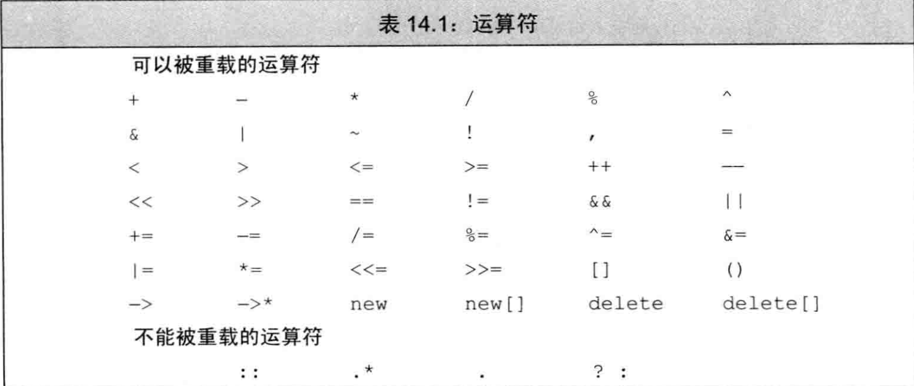

[TOC]
# 第八章 重载运算符

之前在类的介绍中，我们简述了一下关于重载
运算符的一些知识，接下来我们会详细讲述重载运算符。

## 8.1 重载运算符概念

重载运算符(overloaded operator)本质上就是函数，可以声明或者定义。其名字由operator关键字后接表示要定义的运算符的符号组成。

### 8.11 重载运算符的形式

大部分的重载运算符声明形式为:
1. > 返回类型 operator 运算符号 形参表 (可选 限定符);
2. > auto operator 运算符号 形参表 -> 返回类型 (可选 限定符);

比如，赋值运算符就是一个函数。
类似于任何其他函数，大部分的运算符函数也有一个返回类型和一个参数列表。

> 和普通函数一样，相同运算符的重载运算符可以定义多个，也就是重载运算符的重载，其也要遵循函数重载的规则。

重载运算符的每个形参是表示运算符的每个运算对象，一个重载运算符的形参数量必须要与其运算对象数目相同。
比如一元运算符有一个参数，二元运算符有两个。
对于二元运算符来说，左侧运算对象传递给第一个参数，而右侧运算对象传递给第二个参数。

除了重载的函数调用运算符`operator()`之外，其他重载运算符都不能含有默认实参。

对于大多数重载运算符来说，它们既可以是普通函数，也可以是成员函数，比如算术运算符；不过有些重载运算符只能是普通函数或者是成员函数，比如赋值运算符只能为成员函数。

> 作为成员函数的重载运算符和普通成员函数一样，可以定义在类内或类外，也可以为静态、const、引用或者虚函数成员。

如果一个运算符是一个非静态成员函数，则其左侧的运算对象就绑定到隐式的this参数，其他的运算对象就按照顺序绑定到其他显式形参上。
比如，对于一个二元运算符如赋值运算符来说，左侧的运算对象绑定到隐式的this参数，其右侧运算对象就作为显式参数传递。

对于所有重载运算符来说，不管是隐式还是显式形参，都必须至少含有一个类类型(也就是不能运算对象全是内置类型)。

```c++
struct Cls
{
    int ins = 5;
    // 赋值运算符：\
    为成员函数，\
    左侧运算对象为该类对象，\
    右侧运算对象为int对象，\
    返回赋值后的左侧运算对象
    Cls& operator=(int val) { this->ins = val; return *this; }
};
// 加法运算符：\
  为普通函数，\
  左侧运算对象为Cls类对象，\
  右侧运算对象为int对象，\
  返回执行加法后的int值。
int operator+(Cls& cls, int val) { return cls.ins + val; }
```

### 8.12 重载运算符的规则

我们可以重载大多数（但不是全部）运算符。下表指明了哪些运算符可以被重载，哪些不行。


我们只能重载上表已有的运算符，而无权发明新的运算符号。例如，我们不能提供`operator**`来执行幂操作。

当某些符号可以表示多种不同的运算符时，我们可以从参数的数量推断到底定义的是哪种运算符。
比如符号`-`既是一元运算符也是二元运算符。

不管我们重载什么运算符，我们都无法改变该运算符的优先级和结合律。
当我们重载规定了求值顺序或者含有短路求值属性的运算符时，该运算符的求值顺序和短路求值属性就不再生效了。

### 8.13 重载运算符的使用

对于重载运算符，我们有两种调用方法：
* 隐式调用：
  当我们定义了重载运算符后，在这些重载运算符的可用范围内，当出现含有运算符的表达式时，就会根据运算符的运算对象的类型隐式调用匹配的重载运算符；比如，对于某个运算对象为类类型对象来说，编译器会首先自动调用该对象类型的对应非静态重载运算符。
* 显式调用：
  因为重载运算符也是函数，所以我们可以用调用函数的形式显式调用重载运算符，并在实参表中传递对应类型的实参。

```c++
struct Cls
{
    int ins = 5;
    Cls& operator=(int val) { this->ins = val; return *this; }
};
int operator+(Cls& cls, int val) { return cls.ins + val; }

Cls obj;
// 隐式调用成员函数Cls& operator=(int val)。
obj = 78;
// 显式调用成员函数Cls& operator=(int val)。
obj.operator=(30);
// 输出30
cout << obj.ins;
// 以下都为调用普通函数int operator+(Cls& cls, int val)。
// 隐式调用，输出45
cout << obj + 15;
// 显式调用，输出45
cout << operator+(obj, 15);
```

> 所以对于静态重载运算符来说，只能显式调用来使用该运算符函数。

### 8.14 关于重载运算符的建议

虽然我们可以在重载运算符的规则内定义任何合法的运算符，但是为了保证用户在使用重载运算符不会出现错误以及良好的理解，我们在重载运算符时应该注意一下几点：

* 不应该被重载的运算符。
* 定义时要与内置类型的运算符含义一致。
* 复合赋值运算符的定义时机。
* 成员或者非成员运算符函数的选择。

**不应该被重载的运算符**

* 含有求值顺序或短路求值属性的运算符。
* 逗号运算符和取地址运算符。

对于本身就含有求值顺序或短路求值属性的运算符，我们不应该重载，因为这些运算符的重载版本无法保留这些属性，因此不建议重载它们。
当代码使用了这些运算符的重载版本时，用户可能会突然发现他们一直习惯的求值规则不再适用了。

我们一般也不重载逗号运算符和取地址运算符：因为C++语言已经定义了这两种运算符用于类类型对象时的特殊含义，这一点与大多数运算符都不相同。
因为这两种运算符已经有了内置的含义，所以一般来说它们不应该被重载，否则它们的行为将异于常态，从而导致类的用户无法适应。

**定义时要与内置类型的运算符含义一致**

当你开始设计一个类时，首先应该考虑的是这个类将提供哪些操作。在确定类需要哪些操作之后，才能思考到底应该把每个类操作设成普通函数还是重载的运算符。如果某些操作在逻辑上与运算符相关，则它们适合于定义成重载的运算符，否则就不要定义重载的运算符。
也就是只有当操作的含义对于用户来说清晰明了时才使用运算符。

**复合赋值运算符的定义时机**

赋值运算符的行为与复合版本的类似：赋值之后，左侧运算对象和右侧运算对象的值相等，并且运算符应该返回它左侧运算对象的一个引用。重载的赋值运算应该继承而非违背其内置版本的含义。

如果类含有算术运算符或者位运算符，则最好也提供对应的复合赋值运算符。无须赘言，`+=`运算符的行为显然应该与其内置版本一致，即先执行`+`，再执行`=`。

**成员或者非成员运算符函数的选择**

当我们定义重载的运算符时，必须首先决定是将其声明为类的成员函数还是声明为一个普通的非成员函数。在某些时候我们别无选择，因为有的运算符必须作为成员；另一些情况下，运算符作为普通函数比作为成员更好。

下面的准则有助于我们在将运算符定义为成员函数还是普通的非成员函数做出抉择：
* 赋值`=`、下标`[]`、调用`()`和成员访问箭头`->`运算符被规定必须是成员。 
* 复合赋值运算符一般來说应该是成员。 
* 改变对象状态的运算符或者与给定类型密切相关的运算符，如递增、递减和解引用运算符，通常应该是成员。
* 具有对称性的运算符可能转换任意一端的运算对象，例如算术、相等性、关系和位运算符等，因此它们通常应该是普通的非成员函数。

## 8.2 输入和输出运算符

如我们所知，IO标准库分别使用`>>`和`<<`执行输入和输出操作。
对于这两个运算符来说，IO库定义了用其读写内置类型的版本，而类则需要自定义适合其对象的新版本以支持IO操作。

输入输出运算符必须是非成员函数，否则，它们的左侧运算对象将是我们的类的一个对象，则它们也必须istream或ostream的成员。
然而，这两个类属于标准库，并且我们无法给标准厍中的类添加任何成员。

IO运算符通常需要读写类的非公有数据成员，所以IO运算符一般被声明为友元。

### 8.21 输出运算符

通常情况下，输出运算符的第一个形参是一个非常量ostream对象的引用。之所以ostream是非常量是因为向流写入内容会改变其状态；而该形参是引用是因为我们无法直接复制一个ostream对象。
第二个形参一般來说是一个常量的引用，该常量是我们想要打印的类类型。第二个形参是引用的原因是我们希望避免复制实参；而之所以该形参可以是常量是因为(通常情况下)打印对象不会改变对象的内容。
为了与其他输出运算符保持一致，`operator<<`般要返回它的ostream形参。

输出运算符尽量减少格式化操作：
用于内置类型的输出运算符不太考虑格式化操作，尤其不会打印换行符，用户希望类的输出运算符也像如此行事。如果运算符打印了换行符，则用户就无法在对象的同一行内接着打印一些描述性的文本了。相反，令输出运算符尽量减少格式化操作可以使用户有权控制输出的细节。

### 8.22 输入运算符

通常情况下，输入运算符的第一个形参是运算符将要读取的流的引用，第二个形参是将要读入到的（非常量）对象的引用。该运算符通常会返回某个给定流的引用。第二个形参之所以必须是个非常量是因为输入运算符本身的目的就是将数据读入到这个对象中。

输入运算符必须处理输入可能失败的情况，当读取操作发生错误时，输入运算符应该负责从错误中恢复。

## 8.3 算术和关系运算符

通常情况下，我们把算术和关系运算符定义成非成员函数以允许对左侧或右侧的运算对象进行转换。因为这些运算符一般不需要改变运算对象的状态，所以形参都是常量的引用。

> 如果类同时定义了算术运算符和相关的复合赋值运算符，则通常情况下应该使用复合赋值来实现算术运算符。

### 8.31 相等运算符

通常情况下，C++中的类通过定义相等运算符来检验两个对象是否相等。也就是说，它们会比较对象的每一个数据成员，只有当所有对应的成员都相等时才认为两个对象相等。

所以对于相等运算符的定义，应该考虑以下设计准则：
* 如果一个类含有判断两个对象是否相等的操作，则它显然应该把函数定义成`operator==`而非一个普通的命名函数：
  因为用户肯定希望能使用`==`比较对象，所以提供了`==`就意味着用户无须再费时费力地学习并记忆一个全新的函数名字；此外，类定义了`==`运算符之后也更容易使用标准库容器和算法。
* 如果类定义了`operator==`，则该运算符应该能判断一组给定的对象中是否含有重复数据。
* 通常情况下，相等运算符应该具有传递性，换句话说，如果`a==b`和`b==c`都为真，则`a==c`也应该为真。
* 如果类定义了`operator==`,则这个类也应该定义`operator!=`。对于用户来说，当他们能使用`==`时肯定也希望能使用`!=`，反之亦然。
* 相等运算符和不相等运算符中的一个应该把工作委托给另外一个，这意味着其中一个运算符应该负责实际比较对象的工作，而另一个运算符则只是调用那个真正工作的运算符。

### 8.32 关系运算符

定义了相等运算符的类也常常（但不总是）包含关系运算符。特别是，因为关联容器和一些算法要用到小于运算符，所以定义`operator<`会比较有用。

通常情况下关系运算符应该考虑以下设计准则：
* 定义顺序关系，令其与关联容器中对关键字的要求一致
* 如果类同时也含有`==`运算符的话，则定义一种关系令其与`==`保持一致。特别是，如果两个对象是`!=`的，那么一个对象应该`<`另外一个。

> 如果存在唯一一种逻辑可靠的`<`定义，则应该考虑为这个类定义`<`运算符。如果类同时还包含`==`，则当且仅当`<`的定义和`==`产生的结果一致时才定义`<`运算符。

## 8.4 赋值运算符

之前已经介绍过拷贝赋值和移动赋值运算符，它们可以把类的一个对象赋值给该类的另一个对象。此外，类还可以定义其他赋值运算符以使用别的类型作为右侧运算对象。

和拷贝赋值及移动赋值运算符一样，其他重载的赋值运算符也必须先释放当前内存空间，再创建一片新空间。

> 我们可以重载赋值运算符。不论形参的类型是什么，赋值运算符都必须定义为成员函数。

### 8.41 复合赋值运算符

复合赋值运算符不非得是类的成员，不过我们还是倾向于把包括复合赋值在内的所有赋值运算都定义在类的内部。为了与内置类型的复合赋值保持一致，类中的复合赋值运算符也要返回其左侧运算对象的引用。

## 8.5 下标运算符

表示容器的类通常可以通过元素在容器中的位置访问元素，这些类一般会定义下标运算符`operator[]`。

> 下标运算符必须是成员函数。

为了与下标的原始定义兼容，下标运算符通常以所访问元素的引用作为返回值，这样做的好处是下标可以出现在赋值运算符的任意一端。

进一步，我们最好同时定义下标运算符的常量版本和非常量版本，当作用于一个常量对象时，下标运算符返回常量引用以确保我们不会给返回的对象赋值。

## 8.6 递增和递减运算符

在迭代器类中通常会实现递增运算符`++`和递减运算符`--`这两种运算符使得类可以在元素的序列中前后移动。

C++语言并不要求递增和递减运算符必须是类的成员，但是因为它们改变的正好是所操作对象的状态，所以建议将其设定为成员函数。

对于内置类型来说，递增和递减运算符既有前置版本也有后置版本。同样，我们也应该为类定义两个版本的递增和递减运算符。

### 8.61 前置递增/递减运算符

假设类为Cls，则通常成员函数的前置递增/递减运算符声明为：

```c++
struct Cls
{
    // 前置递增运算符
    Cls& operator++();
    // 前置递减运算符
    Cls& operator--();
};
```

> 为了与内置版本保持一致，前置运算符应该返回递增或递减后对象的引用。

### 8.62 后置递增/递减运算符

因为前置和后置版本的符号一样，为了解决这个问题，后置版本接受一个额外的(不被使用)int类型的形参。

> 只接受唯一一个int形参，不能有更多的形参或者非int形参。

当我们使用后置运算符时，编译器为这个形参提供一个值为0的实参。

尽管从语法上来说后置函数可以使用这个额外的形参，但是在实际过程中通常不会这么做。这个形参的唯一作用就是区分前置版本和后置版本的函数，而不是真的要在实现后置版本时参与运算。

> 因为我们不会用到int形参，所以无须为其命名。

```c++
struct Cls
{
    // 后置递增运算符
    Cls& operator++(int);
    // 后置递减运算符
    Cls& operator--(int);
};
```

为了与内置版本保持一致，后置运算符应该返回对象的原值(递增或递减之前的值)，返回的形式是一个值而非引用。

#### 8.621 后置版本的显式调用

当显式地调用后置运算符时，必须要向其传递一个int实参，因为编译器只有通过它才能知道应该使用后置版本。

## 8.7 成员访问运算符

在迭代器类及智能指针类中常常用到解引用运算符`*`箭头运算符`->`。

通常箭头运算符不执行任何自己的操作，而是调用解引用运算符并返回解引用结果元素的地址。

> 箭头运算符必须是类的成员。而解引用运算符通常也是类的成员，尽管并非必须如此。

### 8.71 箭头运算符的限制

和大多数其他运算符一样(尽管这么做不太好)，我们能令`operator*`完成任何我们指定的操作。换句话说，我们可以让`operator*`返回一个固定值42,或者打印对象的内容，或者其他。

箭头运算符则不是这样，它永远不能丢掉成员访问这个最基本的含义。当我们重载箭头时，可以改变的是箭头从哪个对象当中获取成员，而箭头获取成员这一事实则永远不变。

对于形如`point->mem`的表达式来说，`point`必须是指向类对象的指针或者是一个重载了 `operator->`的类的对象。

根据`point`类型的不同，`point->mem`分別等价于
```c++
(*point).mem; // point是一个内置的指针类型
point.operator()->mem; // point是类的一个对象
```
除此之外，代码都将发生错误。

`point->mem`的执行过程如下所示：

1. 如果`point`是指针，则我们应用内置的箭头运算符，表达式等价于`(*point).mem`。
   首先解引用该指针，然后从所得的对象中获取指定的成员。如果`point`所指的类型没有名为`mem`的成员，程序会发生错误。
2. 如果`point`是定义了`operator->`的类的一个对象，则我们使用`point.operator->()`
的结果来获取`mem`。
其中，如果该结果是一个指针，则执行第1步；如果该结果本身含有重载的`operator->()`，则重复调用当前步骤。
最终，当这一过程结束时程序或者返回了所需的内容，或者返回一些表示程序错误的信息。

> 所以重载的箭头运算符必须返回类的指针或者自定义了箭头运算符的某个类的对象。