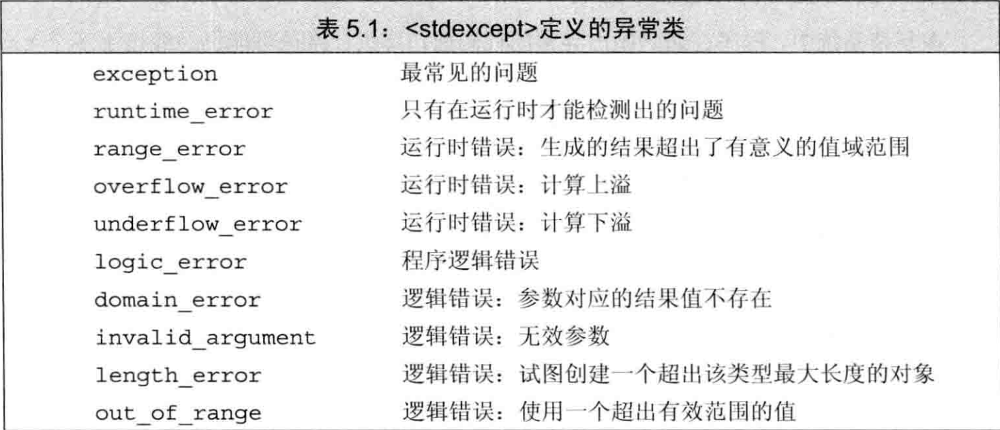
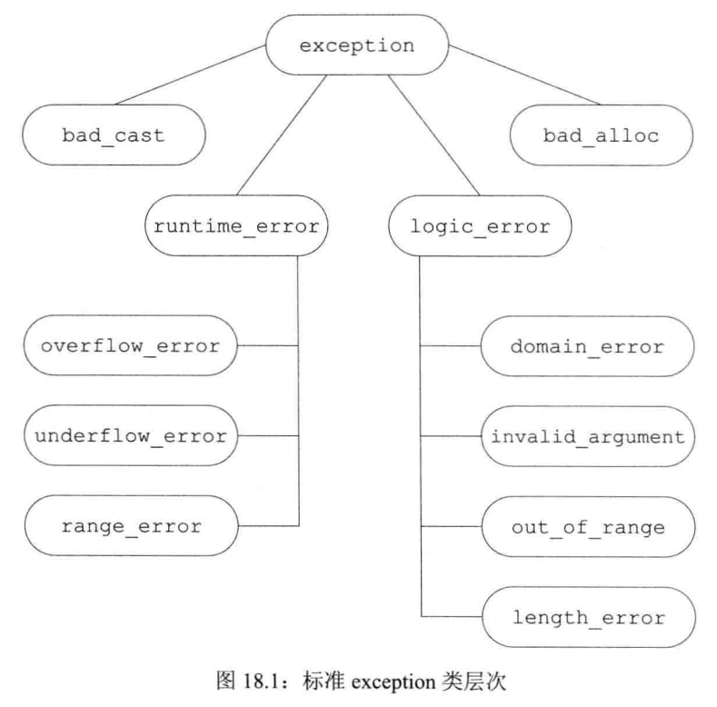

[TOC]
# 第九章 异常处理

异常处理是在程序开发时非常重要的一部分。

异常处理（exception handling）机制允许程序中独立开发的部分能够在运行时就出现的问题进行通信并做出相应的处理。

异常使得我们能够将问题的检测与解决过程分离开来。
程序的一部分负责检测问题的出现，然后解决该问题的任务传递给程序的另一部分。
检测环节无须知道问题处理模块的所有细节，反之亦然。

## 9.1 异常处理的概念

异常是指存在于运行时的反常行为，这些行为超出了函数正常功能的范围。

典型的异常包括失去数据库连接以及遇到意外输入等。处理反常行为可能是设计所有系统最难的一部分。
当程序的某部分检测到一个它无法处理的问题时，需要用到异常处理。

异常处理机制分为两部分：
* 异常检测
* 异常处理

**异常检测**

该部分应该发出某种信号以表明程序遇到了故障，无法继续下去了，而且信号的发出方无须知道故障将在何处得到解决。一旦发出异常信号，检测出问题的部分也就完成了任务。

在C++语言中，异常检测部分是通过`throw`表达式(throw expression)来进行的。

使用`throw`表达式来表示它遇到了无法处理的问题。所以我们可以说`throw`引发(raise)了异常。

**异常处理**

如果程序中含有可能引发异常的代码，那么通常也会有异常处理代码来处理这些问题。例如，如果程序的问题是输入无效，则异常处理部分可能会要求用户重新输入正确的数据；如果丢失了数据库连接，会发出报警信息。

异常处理部分使用`try`语句块以及`catch`子句来处理异常。
`try`语句块以关键字`try`开始，并以一个或多个`catch`子句(catch clause)结束。`try`语句块中代码抛出的异常通常会被某个`catch`子句处理。因为catch子句“处理”异常，所以它们也被称作异常处理代码(exception handler)。

C++语言的标准库还定义了一套异常类(exception class)，用于在`throw`表达式和相关的`catch`子句之间传递异常的某些具体信息。

## 9.2 异常处理的流程

程序正常执行时，编译器会按照C++代码所规定的顺序执行其他非`catch`子句的语句，但是如果遇到了抛出异常的代码时，编译器就会进入异常处理模式。

通常的异常处理过程可以分为以下几个步骤，这个步骤被称为栈展开(stack unwinding)过程：
1. 当一个`throw`表达式被执行时(包括调用函数的该函数中的或者创建类对象时隐式调用的构造函数中的)，该表达式就会抛出异常，然后编译器检查包含这个`throw`表达式的作用域是否为`try`语句块：
   如果该作用域不为`try`语句块，则转到第2步，否则转到第3步。
2. 检查包含该作用域(或者语句块)的作用域是否为`try`语句块，不是则继续向外层找，以此类推：
   如果没有找到任何`try`语句块，则编译器调用标准库函数`terminate`，`terminate`负责终止程序的执行；
   如果找到了`try`语句块，则转到第3步。
3. 检査与该`try`语句块关联的`catch`子句是否有与其抛出异常匹配的子句：
   如果找到了匹配的`catch`子句，就使用该子句处理异常，当该`catch`子句处理完毕后，有两种情况：
   1. 如果该`catch`子句关联的是构造函数`try`语句块或者析构函数`try`语句块，则编译器会在调用该构造或析构函数的位置重新抛出该异常并回到第2步进行操作。
   2. 否则，程序跳转到关联该`catch`子句的`try`语句块的最后一个`catch`子句之后的位置继续正常执行。
    如果没有找到匹配的子句，则回到第2步。

> 如果一个异常没有被捕获，则它将调用标准库函数`terminate`来终止当前的程序。

在栈展开过程中，每次编译器跳转到外层作用域进行查找时，就和函数调用完毕一样，之前内层的作用域的所有非静态局部变量都会自动执行销毁。

不管是构造函数发生异常还是其他情况的异常，编译器都将确保在这个块中创建的非静态对象能被正确地销毁：
如果某个局部对象的类型是类类型，则该对象的析构函数将被自动调用；与往常一样，编译器在销毁内置类型的对象时不需要做任何事情。

> 因为编译器是通过调用析构函数来销毁对应类型的对象的，所以如果析构函数本身抛出了异常，且该异常也没有被处理，则程序将被异常终止。

## 9.3 异常检测部分

### 9.31 throw表达式

在C++语言中，我们通过抛出（throwing）一条表达式来引发（raised）一个异常。

`throw`表达式包含关键字`throw`和紧随其后的一个表达式，其中紧随其后的表达式的类型就是抛出的异常类型，该表达式的结果也就叫做异常对象。
`throw`表达式后面通常紧跟一个分号，从而构成一条表达式语句。

`throw`表达式的形式为：
> throw 表达式

```c++
throw 3.6 + 15;
```

> 根据异常处理的流程，当执行一个`throw`表达式时，同作用域的跟在`throw`后面的语句将不再被执行。

### 9.32 异常对象

异常对象（exception object）是一种特殊的对象，该对象由`throw`表达式來创建并初始化的，`throw`表达式后面紧跟的表达式结果也就是异常对象。

`throw`表达式的异常对象表达了所抛出的异常信息，随后异常处理部分的`catch`子句会根据该异常对象的类型进行匹配并处理该异常。

异常对象位于由编译器管理的特殊空间中，编译器确保无论最终调用的是哪个`catch`子句，都能访问到该空间中的异常对象。当异常处理完毕后，异常对象就会被销毁。

> 异常对象可以为空，也就是`throw`后面直接跟`;`，此时由于异常对象为空，没有任何`catch`子句能够匹配到，所以编译器会执行标准库函数`terminate`来终止程序。

**异常对象的形式**

`throw`表达式后面紧跟的表达式的静态类型决定了异常对象的类型；且`throw`表达式是用该表达式的结果值对异常对象进行拷贝初始化。

对于表达式的静态类型是数组类型或函数类型来说，异常对象的类型则是与之对应的指针类型，且表达式的结果值也转换成了与之对应的指针类型。

因为表达式的静态类型决定了异常对象的类型，所以如果一条`throw`表达式解引用一个基类指针，而该指针实际指向的是派生类对象，则抛出的对象将被切掉一部分，只有基类部分被抛出。

对于异常对象的类型，有以下几种规定：
* 必须是完全类型。
* 如果是类类型的话，则相应的类必须含有一个可访问的析构函数和一个可访问的拷贝或移动构造函数。

## 9.4 异常处理部分

当`throw`表达式抛出了异常后，被抛出的表达式的类型以及当前的调用链共同决定了哪段处理代码（handler）将被用来处理该异常。

被选中的处理代码是在调用链中与抛出对象类型匹配的最近的处理代码。其中，根据抛出对象的类型和内容，程序的异常抛出部分将会告知异常处理部分到底发生了什么错误。

异常处理部分使用`try`语句块以及`catch`子句来处理异常。

### 9.41 try语句块

`try`语句块的通用语法形式是：
> try 复合语句 catch 复合语句···

`try`语句块的一开始是关键字`try`，随后紧跟着一个复合语句。
`try`语句块后面必须跟一个或多个`catch`子句，这些`catch`子句也就是与之关联的子句。

`try`语句块中的复合语句是一个局部作用域，可以包含任意能在复合语句中使用的代码。

#### 9.411 函数try语句块

通常情况下，程序执行的任何时刻都可能发生异常，特别是异常可能发生在函数执行中。

虽然我们可以在函数体中写上`try`语句，但是如果我们想对整个函数体进行异常处理时，就行不通了。

还有一些特殊函数：
* 比如构造函数在进入其函数体之前首先执行初始值列表。因为在初始值列表抛出异常时构造函数体内的`try`语句块还未生效，所以构造函数体内的`catch`子句无法处理构造函数初始值列表抛出的异常。
* 比如在析构函数体内的`catch`子句不能处理隐式析构部分抛出的异常。

所以为了处理函数执行时抛出的异常，我们可以将这些函数写成函数`try`语句块(也称为函数测试块，function try block)的形式。

函数`try`语句块的定义形式为：
* > 对于构造函数来说：
    >
    > (可选 类型限定符) 类名 形参表 (可选 类型限定符) try 初始值列表 函数体 catch子句
* > 对于析构函数来说：
    >
    > (可选 类型限定符) ~类名 () (可选 类型限定符) try 函数体 catch子句
* > 对于其他函数来说：
    >
    > (可选 类型限定符) 返回类型 函数名 形参表 (可选 类型限定符) try 函数体 catch子句
    > (可选 类型限定符) auto 函数名 形参表 (可选 类型限定符) -> 返回类型 try 函数体 catch子句

所以函数`try`语句块中的`try`部分没有复合语句块。
而且函数`try`语句块只能出现在函数定义中，不能在函数声明时出现。

> `constexpr`构造函数不能使用函数`try`语句块。

```c++
struct Cls
{
    int ins;
    inline Cls(int val);
    // 静态成员函数try语句块
    static auto prints() -> void try { cout << "Cls\n"; } catch(int obj) { cout << obj << " error\n"; }
    // 成员函数try语句块
    auto ret(int val) const -> int try { return val*val; } catch(int obj) { cout << obj << " error\n"; }
    // 析构函数try语句块
    virtual ~Cls() try {} catch(int obj) { cout << obj << " error\n"; }
};
// 构造函数try语句块
inline Cls::Cls(int val) try: ins(8) {} catch(int obj) { cout << obj << " error\n"; }
// 普通函数try语句块
void prints2() try { cout << "External\n"; } catch(int obj) { cout << obj << " error\n"; }
```

对于函数`try`语句块来说，其关联的`catch`子句既能处理构造函数体(或者析构函数体和普通函数体)，也能处理构造函数的初始化部分(或析构函数的析构部分)。

> 对于成员函数`try`语句块(包括构造和析构函数)来说，其关联的`catch`子句能像该成员函数本身一样对该类其他成员有着一些访问权限；且该`catch`子句还能使用这些函数的形参(但不能用函数体定义的局部变量)，所以`catch`子句的异常声明不能与这些形参同名。

对于构造和析构函数`try`语句块来说，当这些函数`try`语句块关联的`catch`子句处理完异常后，编译器还会在这些函数的调用位置重新抛出该异常并继续执行异常处理。

```c++
struct Cls
{
    int ins;
    Cls(int val) try: ins(8) { throw 56; } catch(int obj) { cout << obj << " error\n"; }
};
void prints() try { throw "prints"; } catch(const char* str) { cout << str << " error\n"; }
/* 输出
prints error 
56 error     
capture again*/
try
{
    prints();
    Cls ob(3);
}
catch (int obj) { cout << "capture again\n"; }
```

不管某函数是不是函数`try`语句块形式，该函数的所有形参的初始化都不属于函数`try`语句块的一部分，在形参的初始化过程中发生的异常是属于调用表达式的。
所以在函数形参初始化过程中发生的异常只能在其调用表达式的上下文中处理了。

```c++
struct Ex
{ Ex() { throw "Ex"; } };
struct Cls
{
    Ex ins;
    Cls(Ex val) try: ins() {} catch(const char* str) { cout << str << " error\n"; }
};
// 输出Ex capture
try { Cls ob({}); }
catch (const char* obj) { cout << obj << " capture\n"; }
```

### 9.42 catch子句

`catch`子句的形式为：
> catch (异常声明) 复合语句

每个`catch`子句只与同作用域下的最近的`try`语句块关联。

`catch`子句中的复合语句也是一个局部作用域，可以包含任意能在复合语句中使用的代码。

异常声明(exception declaration)类似于**只包含一个形参**的函数形参列表，异常声明不能为空。
像在形参列表中一样，如果`catch`无须访问该参数的话，则我们可以在定义中省略该参数名字。

该声明参数的类型决定了处理代码所能捕获的异常类型。这个类型必须是完全类型，它可以是左值引用，但不能是右值引用。

当进入一个`catch`语句后，通过异常对象初始化异常声明中的参数。

和函数的参数类似，如果`catch`的参数类型是非引用类型，则该参数是异常对象的一个副本，在`catch`语句内改变该参数实际上改变的是局部副本而非异常对象本身；相反，如果参数是引用类型，则和其他引用参数一样，该参数是异常对象的一个别名，此时改变参数也就是改变异常对象。

```c++
try
{
    int ins;
    cin >> ins;
    if (ins == 0) throw "Can't divide by zero!";
    else cout << 35.0 / ins;
}
catch (const char* str)
{ cout << str << endl; }
```

> `catch`参数和普通函数的形参类似，支持继承的动态绑定。所以，通常情况下，如果`catch`接受的异常与某个继承体系有关，则最好将该`catch`的参数定义成引用类型。

#### 9.421 catch子句的匹配过程

`catch`子句的匹配过程也就叫做捕获异常过程。
子句的匹配过程是根据抛出的异常对象的类型和`catch`子句中的异常声明的类型来匹配的。

与实参和形参的匹配规则相比，`catch`子句的匹配规则受到更多限制。
此时，绝大多数类型转换都不被允许，除了一些极细小的差別之外，要求异常的类型和`catch`声明的类型要基本上精确匹配。

以下`catch`语句的匹配规则：
* 要按照`catch`语句的出现顺序逐一进行匹配，只要出现一个语句能匹配时，就会匹配成功而忽略之后的`catch`语句。
* 只允许以下的类型转换，除此之外的其他所有转换规则(包括算术类型转换和类类型转换在内)都不能使用：
  * 允许非顶层const和顶层const的相互类型转换。
  * 允许从非底层const向底层const的类型转换。
  * 允许从派生类向基类的类型转换(包括其指针和引用)。
  * 允许数组和函数被转换成对应类型的指针。

```c++
try
{
    const int ins = 18;
    // 按照规则，匹配的是catch (int val)，\
    所以输出error1 18
    throw ins;
}
catch (int val)
{ cout << "error1 " << val << endl; }
catch (const int val)
{ cout << "error2 " << val << endl; }
catch (double val)
{ cout << "error3 " << val << endl; }
```

#### 9.422 捕获所有异常

有时我们希望不论抛出的异常是什么类型，程序都能统一捕获它们。
为了一次性捕获所有异常，我们使用省略号`...`作为`catch`语句的异常声明，这样的处理代码称为捕获所有异常(catch-all)的处理代码，形如`catch(...)`的`catch`语句可以与任意类型的异常对象匹配(除了空异常对象，空异常对象不能被任何`catch`语句捕获)。

形如`catch(...)`的`catch`语句既能单独关联某个`try`语句块，也能与其他几个`catch`语句一起关联，但是`catch(...)`语句必须要放在这些`catch`语句的最后一个，否则编译出错。

> 使用省略号的异常声明中只能有省略号而不能有其他的符号或者标识符，所以对于捕获所有异常的`catch`语句来说，我们并不能直接用该异常对象。

```c++
// 输出error
try
{
    const int ins = 18;
    throw ins;
}
catch (...)
{ cout << "error" << endl; }
```

#### 9.423 重新抛出

有时，一个单独的`catch`语句不能完整地处理某个异常。在执行了某些校正操作之后，当前的`catch`语句可能会决定由调用链更上一层的函数接着处理异常。
一条`catch`语句通过重新抛出(rethrowing)的操作将异常传递给另外一个`catch`语句。

重新抛出的操作就是在捕获当前异常对象的`catch`子句中写上一个`throw`表达式，由该`catch`子句再次抛出异常，让外层作用域的`catch`子句处理该异常。

> 可以通过多个`catch`子句的`throw`表达式进行多次重新抛出。

关于`catch`子句中`throw`表达式的形式，和普通的`throw`表达式一样，既可以写上异常对象，也可以省略：
* 如果写上了异常对象，则编译器储存该异常对象的类型和初始值。
* 如果省略，则编译器按照之前的异常对象进行传递。

> 要注意如果catch的异常声明为引用类型，那么就会绑定到该异常对象上，所以对引用的修改也会影响到异常对象。

```c++
// 输出error1 18\
    error3 str
try
{
    try
    {
        const int ins = 18;
        throw ins;
    }
    catch (int val)
    { cout << "error1 " << val << endl; throw "str"; }
    catch (const char* str)
    { cout << "error2 " << str << endl; }
}
catch (const char* str)
{ cout << "error3 " << str << endl; }
```

## 9.5 异常说明

对于用户及编译器来说，预先知道某个函数不会抛出异常显然大有裨益。
首先，知道函数不会抛出异常有助于简化调用该函数的代码；其次，如果编译器确认函数不会抛出异常，它就能执行某些特殊的优化操作，而这些优化操作并不适用于可能出错的代码。

### 9.51 异常说明的形式

所以我们可以对函数进行不抛出异常说明来指定某个函数不会抛出异常，这也叫做不抛出说明(nonthrowing specification)。

对于不抛出异常说明，有两种：
* 关键字`throw()`
* 关键字`noexcept`

> 关键字`throw()`是c++11之前标准所设计的，而关键字`noexcept`是c++11新加的，并对用了关键字`noexcept`的函数有特殊优化。

这两种说明符的放置位置是相同的，都是紧跟在函数的参数列表后面；如果函数为成员函数，则说明符还要在`const`及引用限定符之后，`final`、`override`或虚函数的`=0`之前；如果说明符要用于函数的尾置返回类型形式，则应放在返回类型之前。

异常说明符还可以在函数指针的声明和定义中使用，但不能在`typedef`或类型别名中使用。

> 对于每一个使用异常说明符的函数來说，异常说明符必须要在该函数的声明或定义中全都出现，否则出错。

```c++
// 用throw()的函数
void prints() throw();
void prints() throw() { cout << "Print\n"; }
// 用noexcept的函数
auto ret() noexcept -> int { return 15; }
```

### 9.52 异常说明的作用

编译器并不会在编译时检查异常说明符。

实际上，如果一个函数在说明了不抛出异常的同时又含有`throw`语句或者调用了可能抛出异常的其他函数，编译器还是会顺利编译通过，并不会因为这种违反异常说明的情况而报错(不排除个別编译器会对这种用法提出警告)。

所以对于说明了不抛出异常但同时又可能抛出异常的函数来说，程序就会在调用该函数时调用`terminate`函数来终止程序，以确保遵守不在运行时抛出异常的承诺(但对于所有的函数`try`语句块不生效，也就是说函数`try`语句块有无异常说明符都是一样的异常处理流程)。

异常说明符`noexcept`还接受一个可选的实参(有且仅有一个实参)，该实参的类型必须能转换为`bool`类型：如果实参是`true`，则函数不会抛出异常；如果实参是`false`，则函数可能抛出异常。
以下为含有说明符`noexcept`的函数声明，假设函数为`void prints()`
```C++
// 以下两种函数声明都为可能抛出异常的函数声明
void prints();
void prints() noexcept(false);
// 以下三种函数声明都为不抛出异常的函数声明
void prints() noexcept;
void prints() noexcept(1);
void prints() throw();
```

### 9.53 noexcept说明符的规定

尽管`noexcept`说明符不属于函数类型的一部分，但是其仍然会影响函数的使用。

以下是`noexcept`说明符函数的几种规定：

* 声明了不抛出异常的函数指针只能指向不抛出异常的函数，反之则不用。
* 声明了不抛出异常的虚函数，在后续派生类的覆盖中也必须声明不抛出异常，反之则不用。
* 当编译器生成合成拷贝控制成员时，同时也会为其生成一个`noexcept`说明符，该说明符的状态是根据该类成员(包括继承的)的异常说明符来决定的：
  如果合成的拷贝控制成员将会调用的任意函数都承诺不会抛出异常，则该合成的拷贝控制成员是`noexcept`的，反之则是`noexcept(false)`。
* 如果我们定义的析构函数中没有提供异常说明符，则编译器将会为其添加一个`noexcept`说明符。
  和编译器生成合成拷贝控制成员时一样，该说明符的状态是根据该析构函数将会调用的所有函数的异常说明符来决定的。

```c++
struct Ba
{
    int ins;
    virtual void prints() noexcept(0) { cout << ins << endl;}
    virtual void prints2() noexcept { cout << ins << endl;}
};
struct De: Ba
{
    // 正确覆盖
    void prints() {}
    // 正确覆盖
    void prints2() noexcept {}
};

int ret(int val) {}
int ret2(int val) noexcept {}

// 错误：ptr只能指向noexcept函数
int (*ptr) (int) noexcept = ret;
// 正确覆盖
int (*ptr2) (int) noexcept = ret2;
```

### 9.54 noexcept运算符

`noexcept`运算符为一元运算符，运算对象在右侧。
> 运算对象为右值。运算结果为右值。

`noexcept`运算符接受一个或多个非声明或定义的表达式，并返回一个bool类型的右值常量表达式，用于表示给定的表达式是否会抛出异常。

> 所以`noexcept`运算符接受的表达式中不能含有类型名。

`noexcept`运算符的使用形式有两种：
1. > noexcept (*expr*)
2. > noexcept (*expr1*, *expr2*, *expr3*, ···)

`noexcept`运算符会根据表达式结果的异常说明来决定返回`true`还是`false`：
如果该表达式调用的函数做了不抛出说明或者该表达式不是`throw`表达式，则返回`true`，否则返回`false`。

对于第二种形式来说，必须所有的表达式都满足返回`true`的条件，运算符才会返回`true`，否则返回`false`。

和`sizeof`类似，`noexcept`也不用求其运算对象的值而直接得出结果。

> 对于非`throw`表达式的表达式的结果不是由函数调用所得时(也就是表达式只是普通的变量，比如一个函数名或者其他对象名)，`noexcept`运算符一律当作`true`

```c++
void prints() {}
void prints2(int val) noexcept {}
int ins = 18;
// 因为prints2为noexcept函数，所以\
输出1
cout << noexcept(prints2(3));
// 因为prints不为noexcept函数，所以\
输出0
cout << noexcept(prints(), prints2(6));
// 因为ins只是对象名，所以\
输出1
cout << noexcept(ins);
// 因为prints只是函数名，所以\
输出1
cout << noexcept(prints);
```

## 9.6 异常类

C++语言的标准库定义了一组类，用于报告标准库函数遇到的问题。
这些类也叫做异常类(exception class)。

这些异常类也可以在用户编写的程序中使用，它们分别定义在4个头文件中：
* `exception`头文件：
  定义了最通用的异常类型`exception`。
  它只报告异常的发生，不提供任何额外信息。
* `stdexcept`头文件：
  定义了几种常用的异常类型。
* `new`头文件：
  定义了`bad_alloc`异常类型。
* `type_info`头文件：
  定义了`bad_cast`异常类型。

下表为`stdexcept`头文件中定义的异常类型：


标准库所有的异常类型其实是一个继承体系，下图为该继承体系：


异常类型`exception`仅仅定义了拷贝构造函数、拷贝赋值运算符、一个虚析构函数和一个名为`what`的虚函数。

其中`what`函数返回一个`const char*`，该指针指向一个以`'\0'`结尾的字符数组，并且确保不会抛出任何异常。

对于为`exception`、`bad_alloc`、`bad_cast`类型的异常对象来说，它们只支持默认初始化，所以不允许为这些对象提供初始值；但对于为其他标准库异常类型的异常对象来说，它们不支持默认初始化，且它们只能用`string`对象或者字符串字面值来初始化。

继承自异常类型`exception`的其他异常类型的`what`虚函数负责返回用于初始化对应类型的异常对象信息。因为`what`是虚函数，所以当我们捕获基类的引用时，对`what`函数的调用将执行与异常对象动态类型对应的版本。

```c++
try { throw runtime_error("error"); }
// 调用runtime_error类的what函数\
输出error
catch (const exception& err) { cout << err.what(); }
```
