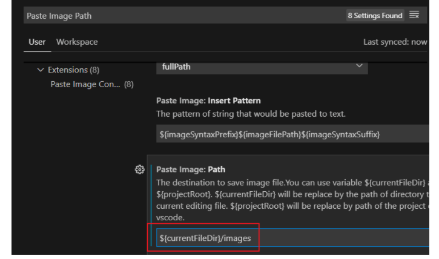

标题

你可以用

# 一级标题
## 二级标题
### 三级标题
#### 四级标题
##### 五级标题
###### 六级标题
#### 符号和标题文字之前要空行

或

一级标题
=======

一级标题
=

二级标题
-------

二级标题
-

个人更推荐前一种方式. (不用对齐, 强迫症福音!)


标题和标题，标题和正文之间空不了行

每写完一个段落要隔一行空行.

就像这样, 隔了一行空行.
（空再多也只是空了一行）

---
三条横线 (或更多的横线) 表示分割线，注意分割线上一行要是空行，否则

就是这样
---

**重点加粗**

*斜体*

~~删除线~~

Markdown Preview Enhanced 拓展功能:

==高亮==

---

列表:
符号和文字之前要空行
（正文和列表之间空不了行）

* 无序列表
  * 嵌套无序列表（按tab缩进就行）
  * 嵌套无序列表
* 无序列表
* 无序列表

1. 有序列表 1
   1. 嵌套有序列表 1
   2. 嵌套有序列表 2
2. 有序列表 2
3. 有序列表 3


Markdown Preview Enhanced 拓展功能:

任务列表:
- [x] 已经完成的事 1
- [x] 已经完成的事 2
- [x] 已经完成的事 3
- [ ] 仍未完成的事 4
- [ ] 仍未完成的事 5

---

引用文本:
符号和文字之前可以不空行
（正文和引用之间空不了行）

> 引用别人说的话
> 就这样写

---

这是 `行内代码` 语法。

这是代码块语法:
格式为:
'''编程语言名字，如python
里面为代码，如：
print("Hello, World!")
'''
请将 ' 替换成 `.


以下为效果图
（正文和代码之间空不了行）


```python
print("Hello, World!")
```

Markdown Preview Enhanced 拓展功能:

代码行数的显示:

``` javascript {.line-numbers}
function add(x, y) {
  return x + y
}
```


---

[超链接名称](链接地址)


例如, 可以使用网址和图床:

[OrangeX4's Blog](https://orangex4.cool/)


也可以在本地用相对地址:

[Other](other.md)



---

表格:
符号和文字之前可以不空行
（正文和表格之间空不了行）

一般是这样的：

| 表头 | 表头 |
| ---- | ---- |
| 内容 | 内容 |
| 内容 | 内容 |

简写可以这样：
（表头下一行必须为-的空行，否则就不是表格形式）

表头|表头
-|-
内容|内容
内容|内容


-: 设置内容和标题栏居右对齐。
:- 设置内容和标题栏居左对齐。
:-: 设置内容和标题栏居中对齐。
实例如下：

| 左对齐 | 右对齐 | 居中对齐 |
| :-----| ----: | :----: |
| 单元格 | 单元格 | 单元格 |
| 单元格 | 单元格 | 单元格 |

**表格内容换行**

Markdown本身不提供单元格换行，但是，Markdown是兼容HTML的，因此，我们可以通过HTML的方式实现单元格换行。
每行后加\<br>实现换行

| 姓名 | 年龄 |  爱好 |
| :-- | :-- | :-- |
| 小明 | 9 | 篮球 |
| 小刚 | 10 | 篮球 <br> 足球 |

**表格中单元格的合并**

合并单元格还是要与HTML网页结合起来，来达到效果。
这会用到HTML的标签：
> colspan：规定单元格可纵深的列数
rowspan：规定单元格可横跨的行数

<table>
    <tr>
        <td>张</td>
        <td>王</td>
    <tr>
    <tr>
        <td colspan="2">姓氏</td>
    <tr>
</table>


Markdown Preview Enhanced 拓展功能:

拓展语法:

| 表头 | 表头 |
| ---- | ---- |
| 内容 | 内容 |
| >   |内容  |

| 表头 | 表头 |
| ---- | ---- |
| 内容 | 内容 |
| ^    | 内容 |

---

注释:

<!-- 你看不见我 -->

<!-- 多行注释
就像这样 -->