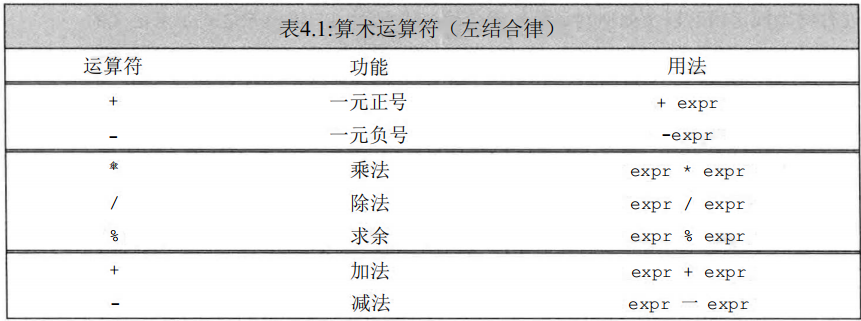
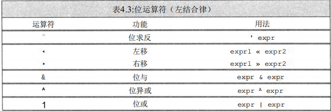
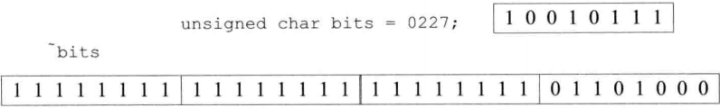

[TOC]
## 第三章 表达式

### 3.1 表达式有关的一些基础概念

#### 3.11 运算符和运算对象

运算符就是作用于某些对象，并根据作用对象来产生一个新的值或对象的标点符号。运算符的作用对象也叫做运算对象。

运算符有几元之称，几元指的是该运算符有几个运算对象：
* 一元运算符（unary operator）
* 二元运算符（binary operator）
* 三元运算符
* 多元运算符

作用一个运算对象的运算符是一元运算符，如取地址符`&`和解引用符`*`。
作用于两个运算对象的运算符是二元运算符，如相等运算符`=`和乘法运算符`*`。
除此之外，还有一个作用于三个运算对象的三元运算符`? :`。
函数调用也是一种特殊的运算符，它对运算对象的数量没有限制。

一些符号既能作为一元运算符也能作为二元运算符。以符号`*`为例，作为一元运算符时执行解引用操作，作为二元运算符时执行乘法作。一个符号到底是一元运算符还是二元运算符由它的上下文决定。对于这类符号来说，它的两种用法互不相干，完全可以当成两个不同的符号。

> 当使用一个运算符时，提供的运算对象的数目必须要和其规定的几元数目一样，否则会出错。

#### 3.12 表达式

表达式由一个或多个运算对象（operand）组成，对表达式求值通常将得到一个结果（result）。

> 表达式本身也可以作为运算对象。

字面值和变量是最简单的表达式（expression），其结果就是字面值和变量的值。

含有两个或多个运算符的表达式及其运算对象的表达式被称为复合表达式（compound expression）

> 只要是没有包含分号的式子，都是表达式而不是语句。
> 比如包含多个逗号分隔开的表达式的复杂表达式，函数调用也是表达式，单一变量名也是表达式。

```c++
int i, j, k;
vector<int> v1{2,5,8,9,36,2,3,5};
// 以下都为表达式而不是语句
i = 250, j = i * 30, k = i + j - 15,
int vsize = v1.size(), vhead = v1.front(),
```

#### 3.13 组合运算

对于含有多个运算符的复杂表达式来说，它们的运算规则会按照每个运算符的特性来运行。
对于每个运算符，都有各自的属性，该属性分为三种：
* 运算符的优先级(precedence)
* 运算符的结合律(associativity)
* 运算对象的求值顺序(order of evaluation)

例如，下面这条表达式的求值结果依赖于表达式中运算符和运算对象的组合方式：
```c++
5 + 10 * 20/2;
// 乘法运算符（*）是一个二元运算符，\
它的运算对象有4种可能：\
10和20、10和20/2、 15和20、15和20/2。
```

#### 3.14 运算对象转换和重载运算符

在表达式求值的过程中，运算对象常常由一种类型转换成另外一种类型。例如，尽管一般的二元运算符都要求两个运算对象的类型相同，但是很多吋候即使运算对象的类型不相同也没有关系，只要它们能被转换成同一种类型即可。

C++语言定义了运算符作用于内置类型和复合类型的运算对象时所执行的操作。当运算符作用于类类型的运算对象时，用户可以自行定义其含义。因为这种自定义的过程事实上是为己存在的运算符赋予了另外一层含义，所以称之为重载运算符(overloaded operator)。

我们使用重载运算符时，其包括运算对象的类型和返回值的类型，都是由该运算符定义的：但是==运算对象的个数、运算符的优先级和结合律都是无法改变的==。

#### 3.15 左值和右值

C++中的所有表达式要不然是右值（rvalue,读作“are-value”），要不然就是左值（lvalue,读作“ell-value”）。

c++中的表达式左右值的区别是根据表达式求值结果的属性来决定的。
当一个表达式的求值结果只能被当作值使用时，该表达式就是右值；当一个表达式的求值结果不仅能被当作值使用，还能当做对象使用时，该表达式就是左值。

所以可以在需要右值的地方可以用左值来代替，但是不能把右值当成左值（也就是位置）使用。当一个左值被当成右值使用时，实际使用的是它的内容（值）。

不管是左值还是右值，它们都是一个占有某空间的对象。所以对于所有左值和右值，它们都能像正常对象一样进行某些操作，比如所有类类型的左值或右值都能通过成员访问符访问其可访问的正常成员。

一般来说，左值和右值是以下几种表达式：
* 左值
   * 变量
* 右值 
  * 临时对象
    * 要求转换的表达式
    * 返回右值的表达式
  * 字面值常量

> 临时对象就是编译器在执行运算对象转换、拷贝或赋值时临时开辟的一个对象，此临时对象会在完成对应操作后自动销毁。

#### 3.16 运算符的优先级和结合律

求复合表达式的值需要首先将运算符和运算对象合理地组合在一起。优先级与结合律(结合顺序)决定了运算对象组合的方式。也就是说，它们决定了表达式中每个运算符对应的运算对象来自表达式的哪一部分。

运算对象组合方式为：
* 运算对象优先与优先级高的运算符结合
* 如果某运算对象左右的运算符优先级相同，则按照运算符的结合律来决定先与谁结合。

```c++
//这条表达式中的括号符合默认的优先级和结合律\
((6 + ( (3 * 4) / 2) ) + 2)
6 + 3*4/2;
```

圆括号无视普通的组合规则，表达式中用圆括号括起来的部分被单独当成一个表达式来求值，然后再与其他部分一起按照组合方式来计算，程序员可以使用圆括号将表达式的某个局部括起来使其得到优先运算。

> 对于有多个圆括号以及嵌套圆括号的表达式，程序从左到右先计算最里面的圆括号的式子，再算外层的。

```c++
//不同的括号组合导致不同的组合结果 
cout « (6+3) * (4/2+2) « endl; 
cout « ((6 + 3) * 4) / 2 + 2 << endl; 
cout <<6+3*4/ (2+2) « endl;
//输出36 
//输出20 
//输出9
```

以下是c++各种运算符的优先级与结合律：


#### 3.17 求值顺序

运算符还有一个重要的属性就是运算对象的求值顺序。

运算对象的求值顺序是指在一条表达式中，所有需要在运行时才能知道值的对象要按照对应运算符的运算对象求值顺序来逐个获取其值，对于没有规定求值顺序的运算符，则获取值的先后是未定义的。

> 运算对象的求值顺序与优先级和结合律无关，一条表达式中并不会出现优先级高的运算符的运算对象先求值，或者按结合律从左往右求值的。
> 运算对象的求值是在表达式进行组合运算之前进行的，对表达式中规定求值顺序的运算符先按照其求值顺序对其运算对象求值，再对其他运算符任意求值。

比如，在一条形如`f()+g()*h()4-j()`的表达式中，对于这些函数的调用顺序没有明确规定。

```c++
/* 我们知道fl和f2一
定会在执行乘法之前被
调用，因为毕竟相乘的
是这两个函数的返回 
值。但是我们无法知道
到底fl在f2之前调用
还是f2在fl之前调用
*/
int i = fl () * f2 ();
```

```c++
/* 因为程序是未定义
的，所以我们无法推断它的行为。编译器可能
先求++i的值再求i的值，此时输出结果是1 1;
也可能先求i的值再求的值，输出结果是0 1;
甚至编译器还可能做完全不同的操作。
*/
int i = 0;
cout « i << ’’ ” << ++i « endl; // 未定义的
```

c++的所有运算符中，有四种运算符明确规定了运算对象的求值顺序，后面的内容会详细介绍着四种运算符的求值顺序。
* 逻辑与`&&`运算符
* 逻辑或`||`运算符
* 条件`?:`运算符
* 逗号`,`运算符

### 3.2 运算符介绍

因为某些运算符可以重载，所以以下介绍的运算符的各种规则主要只适用于大部分系统自带的类型，如算术类型等。

> 对于某些类类型来说，因为重载了运算符，其规则可能会有一些变化，如标准库中的string类型支持其赋值运算符的左侧对象为右值。

```c++
#include <string>
std::string s1 = "s1", s2 = "s2";
// 向右值赋值。
s1 + s2 = "combination";
std::string() = "temp_str";
```

c++的运算符有很多，接下来介绍的是几个常用的运算符：
* 算术运算符
* 逻辑运算符
* 关系运算符
* 赋值运算符
  * 复合赋值运算符
* 递增和递减运算符
* 成员访问运算符
* 条件运算符
* 位运算符
* 逗号运算符
* sizeof运算符

> 在无明确指出的情况下，默认所有运算符与其运算对象之间可以有0个到多个空白符；两个运算对象之间可以有1个到多个空白符。

#### 3.21 算术运算符



> 算术运算符大多数为二元运算符，运算对象在左右侧；一元正负号运算符的运算对象在右侧。
> 运算对象都为右值，运算结果为右值

除非另做特殊说明，算术运算符都能作用于任意算术类型以及任意能转换为算术类型的类型。

一元正号运算符、加法运算符和减法运算符都能作用于指针。

> 求余运算符`%`只能作用于整型。
> 除法运算符`/`右侧不能为0。

#### 3.22 逻辑和关系运算符


> 逻辑和关系运算符大多数为二元运算符，运算对象在左右侧；一元逻辑非运算符的运算对象在右侧。
> 运算对象都为右值，运算结果为右值

关系运算符作用于算术类型或指针类型，逻辑运算符作用于任意能转换成布尔值的类型。

逻辑运算符和关系运算符的==返回值都是布尔类型==。值为0的运算对象(算术类型或指针类型)表示假，否则表示真。

**逻辑与运算符和逻辑或运算符**

对于逻辑与运算符`&&`来说，当且仅当两个运算对象都为真时结果为真；对于逻辑或运算符`||`来说，只要两个运算对象中的一个为真结果就为真。

*逻辑与运算符和逻辑或运算符的求值顺序为*：
逻辑与运算符和逻辑或运算符都是先求左侧运算对象的值再求右侧运算对象的值，当且仅当左侧运算对象无法确定表达式的结果时才会计算右侧运算对象的值。这种策略称为短路求值(short-circuit evaluation)：
* 对于逻辑与运算符来说，当且仅当左侧运算对象为真时才对右侧运算对象求值。 
* 对于逻辑或运算符来说，当且仅当左侧运算对象为假时才对右侧运算对象求值。

逻辑非运算符`!`将运算对象的真值取反后返回。

关系运算符比较运算对象的大小关系并返回布尔值。关系运算符都满足左结合律。

#### 3.23 赋值运算符

> 赋值运算符为二元运算符，运算对象在左右侧。
> 左侧运算对象为左值，右侧运算对象为右值。运算结果为左值。

赋值运算符的左侧运算对象必须是一个可修改的左值。

```c++
int i = 0, j = 0, k. = 0; 
const int ci = i;
//初始化而非賦值 
//初始化而非賦值
1024 = k; //错误：字面值是右值
i + j = k； //错误：算术表达式是右值
ci = k; //错误：ci是常量（不可修改的）
```

赋值运算的结果是它的左侧运算对象，并且是一个左值。如果赋值运算符的左右两个运算对象类型不同，则右侧运算对象将转换成左侧运算对象的类型：

```c++
k = 0; //结果：类型是int,值是0
k = 3.14159; //结果：类型是int,值3
```

> 对于赋值运算符的左侧运算对象为某些类类型时，由于类类型可能重载了一些运算符，所以导致该赋值运算符可以为右值，此时的求值结果仍为左值，如：

```c++
// 合法操作
string a = "str_a", b = "str_b";
string *p = &(a + b = "str_c");
```

C++11新标准允许使用花括号括起来的初始值列表作为赋值语句的右侧运算对象。

如果左侧运算对象是内置类型，那么初始值列表最多只能包含一个值，而且该值即使转换的话其所占空间也不应该大于目标类型的空间；对于类类型来说，赋值运算的细节由类本身决定。

无论左侧运算对象的类型是什么，初始值列表都可以为空。此时，编译器创建一个值初始化的临时量并将其赋给左侧运算对象。

```c++
k = {3.14}; //错误：窄化转换
vector<int> vi; // 初始为空
vi = {0,1,2,3,4,5,6,7,8,9}; // vi 现在含有 10 个元素了，值从 0 到 9
```

##### 3.231 复合赋值运算符

我们经常需要对对象施以某种运算，然后把计算的结果再赋给该对象。为了方便运算，所以就有了复合赋值形式。
一些算术运算符和位运算符有其相应的复合赋值形式：

* 算术运算符
  * `+=`
  * `-=`
  * `*=`
  * `/=`
  * `%=`
* 位运算符
  * `<<=`
  * `>>=`
  * `&=`
  * `^=`
  * `|=`

任意一种复合运算符都完全等价于：
> a = a *op* b;
> 
> *op*为复合赋值运算符，a为该复合赋值运算符的左侧对象，b为该复合赋值运算符的右侧对象。

唯一的区别是左侧运算对象的求值次数：
* 使用复合运算符只求值一次。
* 使用普通的运算符则求值两次。这两次包括：一次是作为右边子表达式的一部分求值，另一次是作为赋值运算的左侧运算对象求值。

#### 3.24 递增和递减运算符

> 递增和递减运算符为一元运算符，前置版本的运算对象在右侧，后置版本的在左侧。
> 运算对象都为左值。前置版本的运算结果为左值，后置版本的为右值。

递增运算符(++)和递减运算符(--)为对象的加1和减1操作提供了一种简洁的书写形式。

这两个运算符还可应用于迭代器，因为很多迭代器本身不支持算术运算，所以此时递增和递减运算符除了书写简洁外还是必须的。

递增和递减运算符有两种形式：
* 前置版本
* 后置版本

前置版本的运算符首先将运算对象加1(或减1)，然后将改变后的对象作为求值结果。
后置版本的也会将运算对象加1(或减1)，但是求值结果是运算对象改变之前那个值的副本(右值)。

```c++
int i = 0, j;
j = ++i； // j = 1, i = 1:前置版本得到递增之后的值
j = i++; // j = 1, i = 2:后置版本得到递增之前的值
```

#### 3.25 成员访问运算符

> 成员访问运算符都为二元运算符，运算对象在左右侧。
> 运算对象都为右值。箭头运算符的运算结果为左值；点运算符右侧的对象为左值，则运算结果为左值，否则为右值。

点运算符`.`和箭头运算符`->`都可用于访问成员，都是用来获取类对象的一个成员的。
其中，点运算符作用于类对象；而箭头运算符只能作用于指针(该指针指向一个类对象)。
它们的使用形式为：
> 类对象.成员名
> 指针->成员名

第二种形式等价于
> (*指针).成员名

```c++
string si = "a string", *p = &sl;
auto n = si.size(); // 运行 string 对象 si 的 size 成员
n = (*p).size () ; //运行p所指对象的size成员
n = p->size () ; // 等价于(*p) . size ()
```

#### 3.26 条件运算符

> 条件运算符都为三元运算符，运算对象在左中右侧。
> 运算对象都为右值。当中间和右侧的运算对象都为左值或者能转化成同一个左值类型时，运算结果为左值，否则为右值。

条件运算符`?:`允许我们把简单的if-else逻辑嵌入到单个表达式当中。
使用形式为：
> *cond* ? *expr1* : *expr2*

> exprl 和 expr2 都不能省略，缺一不可

其中cond是判断条件的表达式，而exprl和expr2是两个类型相同或可能转换为某个公共类型的表达式。

*条件运算符的求值顺序为：*
首先求cond的值，如果条件为真则对exprl求值并返回该值，否则对expr2求值并返回该值。

举个例子，我们可以使用条件运算符判断成 
绩是否合格：
```c++
// 条件部分判断成绩是否小于60。\
如果小于，表达式的结果是”fail”，否则结果是"pass"
string finalgrade = (grade < 60) ? "fail" : "pass";
```

> 条件运算符支持嵌套

```c++
/* 第一个条件检查成绩是否在90分以上，
如果是，执行符号？后面的表达式，得到”high pass”；
如果否，执行符号：后面的分支。
这个分支本身又是一个条件表达式，它检查成绩是否在60分以下，
如果是，得到"fail"；否则得到"pass"
*/
finalgrade = (grade > 90) ? "high pass1'
:(grade < 60) ? "fail" : "pass";
```

#### 3.27 位运算符



运算符名称|几元运算符|运算对象左右值|运算结果左右值
-|-|-|-
IO类左移(<<)|二元|左侧左值，右侧右值|左值
IO类右移(>>)|二元|都为左值|左值
内置类左移(<<)|二元|都为右值|右值
内置类右移(>>)|二元|都为右值|右值
位求反(~)|一元|右侧右值|右值
位与(&)|二元|都为右值|右值
位或(\|)|二元|都为右值|右值
位异或(^)|二元|都为右值|右值

位运算符作用于整数类型的运算对象，并把运算对象看成是二进制位的集合。
位运算符提供检查和设置二进制位的功能。

位运算符能用于bitset类型。

运算对象会进行整数提升，提升时运算对象原来的位保持不变，往髙位(high order position)添加0即可。

运算对象可以是带符号的，也可以是无符号的。如果运算对象是带符号的且它的值为负，那么位运算符如何处理运算对象的“符号位”依赖于机器。而且，此时的左移操作可能会改变符号位的值，因此是一种未定义的行为。

> 强烈建议仅将位运算符用于处理无符号类型。

##### 3.271 左移右移运算符

左移右移这两种运算符的内置含义是对其运算对象执行基于二进制位的移动操作，首先令左侧运算对象的内容按照右侧运算对象的要求移动指定位数，然后将经过移动的（可能还进行了提升）左侧运算对象的拷贝作为求值结果。

其中，右侧的运算对象一定不能为负，而且值必须严格小于结果的位数，否则就会产生未定义的行为。二进制位或者向左移`<<`或者向右移`>>`，移出边界之外的位就被舍弃掉了。


左移运算符`<<`会在右侧插入值为0的二进制位。
而右移运算符`>>`的行为则依赖于其左侧运算对象的类型：如果该运算对象是无符号类型，则会在左侧插入值为0的二进制位; 如果该运算对象是带符号类型，则在左侧插入符号位的副本或值为0的二进制位，如何选择要视具体环境而定。

##### 3.272 位求反运算符

位求反运算符`~`将运算对象逐位求反后生成一个新值，将1置为0、将0置为1。



##### 3.273 位与、位或、位异或运算符

位与`&`、位或`|`、位异或`^`运算符在两个运算对象上逐位执行相应的逻辑操作:


> 位与、位或、位异或运算符都满足交换，结合和分配律。

对于位与运算符`&`来说，如果两个运算对象的对应位置都是1，则运算结果中该位为1，否则为0。

对于位或运算符`|`来说，如果两个运算对象的对应位置至少有一个为1，则运算结果中该位为1，否则为0。

对于位异或运算符`^`来说，如果两个运算对象的对应位置有且只有一个为1，则运算结果中该位为1，否则为0。

#### 3.28 sizeof运算符

> `sizeof`运算符为一元运算符，运算对象在右侧。
> 运算对象为右值。运算结果为右值。

`sizeof`运算符返回一条表达式或一个类型名所占的字节数。
`sizeof`运算符满足右结合律，其所得的值是一个`size_t`类型的常量表达式。
`sizeof`运算符的使用形式为：
> sizeof (*type*)
> sizeof *expr*

> 第一种形式中，类型名一定要在圆括号内。

在第二种形式中，`sizeof`返回的是==表达式结果类型==的大小。`sizeof`并不实际计算其运算对象的值。

> `sizeof`运算符不能作用于函数对象、函数指针和引用。
> `sizeof`运算符也不能作用于不完整类型。

```c++
Sales_data data, *p;sizeof (Sales_data); //存储Sales_data类型的对象所占的空间大小 
sizeof data; //data 的类型的大小，即sizeof (Sales_data) 
sizeof P; // 指针所占的空间大小
sizeof *P; // P所指类型的空间大小，即sizeof (Sales_data)
sizeof data. revenue; // Sales_data的revenue成员对应类型的大小
sizeof Sales_data::revenue; //另一种获取revenue大小的
```

C++11新标准允许我们使用作用域运算符来获取类成员(可访问的成员才行)的大小。
通常情况下只有通过类的对象才能访问到类的成员，但是`sizeof`运算符无须我们提供一个具体的对象，因为要想知道类成员的大小无须真的获取该成员。

对一些特殊类型的对象执行`sizeof`运算会有一些不同：
* 对char或者类型为char的表达式执行`sizeof`运算，结果为1。
* 对引用类型执行`sizeof`运算得到被引用对象所占空间的大小。
* 对指针执行`sizeof`运算得到指针本身所占空间的大小。
* 对解引用指针执行`sizeof`运算得到指针指向的对象所占空间的大小，指针不需有效。
* 对数组执行`sizeof`运算得到整个数组所占空间的大小，等价于对数组中所有的元素各执行一次`sizeof`运算并将所得结果求和。注意，`sizeof`运算不会把数组转换成指针来处理。
* 对类类型或类类型对象执行`sizeof`运算时，所占的字节大小为：
  * 该类类型==所有非静态数据成员==的字节大小的总和，如果该类型==有虚函数==(不管有多少个)，则==在该总和的基础上加8字节==。
  * 如果该类类型没有非静态数据成员和虚函数，则其所占的字节大小为1。
* 对`string`对象或`vector`对象执行`sizeof`运算只返回该类型固定部分的大小，不会计算对象中的元素占用了多少空间。
* 对`union`类型或`union`类型对象执行`sizeof`运算时，所占的字节大小为其==非静态数据成员中类型尺寸最大的成员所占的字节==；如果该类型没有非静态数据成员，则其所占的字节大小为1。
* 对枚举类型或枚举类型对象执行`sizeof`运算时，所占的字节大小为该枚举类型的枚举成员类型的字节大小。

```c++
// sizeof (ia) /sizeof (*ia)返回 ia 的元素数量
constexpr size_t sz = sizeof(ia)/sizeof(*ia);
int arr2[sz]; //正确：sizeof返回一个常量表达式。
```

#### 3.29 逗号运算符

> 逗号运算符为二元运算符，运算对象在左右侧。
> 运算对象都为右值。右侧运算对象为左值时，运算结果为左值，否则为右值。

*逗号运算符的运算对象求值顺序*是按照从左向右的顺序依次求值的。

对于逗号运算符来说，首先对左侧的表达式求值，然后将求值结果丢弃掉。逗号运算符真正的结果是右侧表达式的值。
